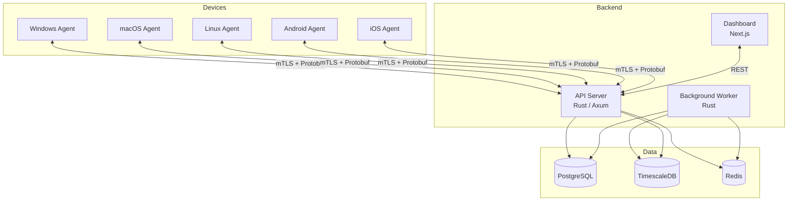

<p align="center">
  <h1 align="center">BetBlocker</h1>
  <p align="center">
    Cross-platform gambling blocking that actually works.
  </p>
</p>

<p align="center">
  
  
  
</p>

---

## The Problem

Gambling addiction affects millions of people worldwide. For someone in recovery, a single
moment of weakness at 2 AM can undo months of progress. Browser extensions get uninstalled.
DNS filters get changed. Willpower is not a blocking strategy.

BetBlocker exists because recovery tools should be harder to remove than the urge to gamble
is to resist. It provides multi-layer, tamper-resistant gambling blocking across every
device a person uses -- controlled by the enrollment model that fits their situation, whether
that is self-directed recovery, accountability with a trusted partner, or compliance with a
court program.

**Free to self-host. Open source. Privacy-first. No data sold, ever.**

---

## What BetBlocker Does

**Multi-Layer Blocking** --
DNS interception, application blocking, and browser content filtering work together so there
is no single layer to bypass. If one fails, the others hold.

**Cross-Platform** --
One Rust codebase compiles to native agents for Windows, macOS, Linux, Android, and iOS.
Every platform gets deep OS integration, not a lowest-common-denominator wrapper.

**Tamper-Resistant** --
Kernel-level file protection on Windows, System Extensions on macOS, AppArmor/SELinux
policies on Linux, Device Admin on Android, MDM profiles on iOS. Agents run as system
services with watchdog processes and binary integrity checks.

**Privacy-First** --
No keylogging. No screen capture. No browsing history collection. Federated intelligence
uses k-anonymity so the central service never sees individual browsing behavior. Blocked
domain metadata only, and only when the enrollment allows it.

**Flexible Enrollment** --
Self-enrolled users control their own settings with a time-delayed unenrollment (24-72h
cooling period). Partner-enrolled users need their accountability partner's approval.
Authority-enrolled users (court programs, institutions) require institutional sign-off with
a full audit trail.

**Self-Hosted or Managed** --
Run the exact same containers on your own infrastructure with `docker compose up`, or use
the hosted platform. No phone-home, no telemetry unless explicitly opted in.

---

## Architecture Overview



The **Endpoint Agent** runs as a system service on each device, handling DNS interception,
app blocking, and tamper detection. It communicates with the **API** over mTLS with
certificate pinning. The **Dashboard** provides enrollment management, device monitoring,
and reporting for users, partners, and authorities. The **Background Worker** processes
blocklist compilation, federated reports, automated discovery, and analytics aggregation.

---

## Platform Support

| Capability | Windows | macOS | Linux | Android | iOS |
|---|:---:|:---:|:---:|:---:|:---:|
| DNS / Network Blocking | WFP driver | Network Extension | iptables / nftables | VpnService | NEDNSProxyProvider |
| Application Blocking | Process monitoring | Process monitoring | Process monitoring | Device Admin | MDM profile |
| Browser Content Filtering | Extension | Extension | Extension | Extension | Extension |
| Tamper Protection | Kernel minifilter | System Extension + Endpoint Security | AppArmor / SELinux | Device Admin / Knox | MDM profile |
| VPN / Proxy Detection | Yes | Yes | Yes | Yes | Yes |
| Offline Blocking | Yes | Yes | Yes | Yes | Yes |

---

## Quick Start

### Self-Hosted Deployment

```bash
git clone https://github.com/JerrettDavis/BetBlocker.git
cd BetBlocker/deploy
docker compose up -d
```

The dashboard is available at `http://localhost:3000` and the API at `http://localhost:8080`.
Billing is disabled by default for self-hosted deployments. The blocklist syncs from the
public BetBlocker community feed.

### Development Setup

**Prerequisites:** Rust 1.75+, Node.js 20+, PostgreSQL 16+, Redis

```bash
# Clone the repo
git clone https://github.com/JerrettDavis/BetBlocker.git
cd BetBlocker

# Build the Rust workspace (API, worker, agent core, CLI)
cargo build

# Run the API server
cargo run -p bb-api

# In a separate terminal, start the web dashboard
cd web
npm install
npm run dev
```

The API serves at `http://localhost:8080/health` and the dashboard at `http://localhost:3000`.

---

## Project Structure

```
betblocker/
+-- crates/
|   +-- bb-common/          Shared types, error handling, config
|   +-- bb-proto/           Protobuf definitions and generated code
|   +-- bb-api/             Central API server (Axum)
|   +-- bb-worker/          Background job processor
|   +-- bb-agent-core/      Cross-platform agent engine
|   +-- bb-agent-plugins/   Plugin trait definitions and registry
|   +-- bb-agent-windows/   Windows agent binary
|   +-- bb-agent-macos/     macOS agent binary
|   +-- bb-agent-linux/     Linux agent binary
|   +-- bb-shim-windows/    Windows native integration (WFP, minifilter)
|   +-- bb-shim-macos/      macOS native integration (System Extension)
|   +-- bb-shim-linux/      Linux native integration (iptables, AppArmor)
|   +-- bb-shim-android/    Android native integration (VpnService, Knox)
|   +-- bb-shim-ios/        iOS native integration (NetworkExtension, MDM)
|   +-- bb-cli/             Developer CLI tooling
+-- web/                    Next.js dashboard (React 19, TypeScript, Tailwind)
+-- deploy/
|   +-- docker-compose.yml  Production self-hosted deployment
|   +-- docker-compose.dev.yml  Development environment
|   +-- docker/             Dockerfiles for each service
|   +-- helm/               Kubernetes Helm chart
|   +-- linux/              Linux-specific deployment configs
|   +-- macos/              macOS-specific deployment configs
|   +-- windows/            Windows-specific deployment configs
|   +-- apparmor/           AppArmor profiles for Linux agents
|   +-- selinux/            SELinux policies for Linux agents
+-- migrations/             SQLx database migrations
+-- tests/                  Integration and end-to-end tests
+-- scripts/                Build and release automation
+-- tools/                  Development tooling
+-- docs/                   Architecture docs, design decisions, plans
```

---

## Tech Stack

| Layer | Technology | Why |
|---|---|---|
| Agent core | **Rust** | Memory safety without GC, compiles to all target platforms, industry standard for security tooling |
| Platform shims | **C / Swift / Kotlin / C#** | Minimal native code for OS APIs that Rust FFI cannot reach directly |
| API server | **Rust (Axum)** | Shared types with agent, single-binary deployment, sub-millisecond routing |
| Background worker | **Rust** | Same codebase as API, shared domain logic |
| Dashboard | **Next.js 16, React 19, TypeScript** | SSR for dashboards, static export for marketing, developer velocity |
| UI components | **shadcn/ui, Tailwind CSS, Recharts** | Accessible components, utility-first styling, data visualization |
| Primary database | **PostgreSQL 16** | Battle-tested relational store with strong ecosystem |
| Analytics | **TimescaleDB** | Time-series optimized, PostgreSQL-compatible |
| Cache / pub-sub | **Redis** | Session management, real-time device status, push notifications |
| Serialization | **Protobuf (prost)** | Compact binary protocol for agent-API communication |
| Billing | **Stripe** | Hosted tier only; disabled via environment flag for self-hosted |

---

## Enrollment Tiers

BetBlocker's core design principle: **the enrollment authority determines the unenrollment
authority, the reporting visibility, and the bypass protection level.**

### Self-Enrollment

For individuals managing their own recovery. You install the agent, choose your protection
level, and set a cooling-off period (24-72 hours) for unenrollment. No one else sees your
data unless you choose to share it.

### Partner Enrollment

For accountability relationships -- a spouse, therapist, sponsor, or trusted friend.
Your partner enrolls your device and must approve any unenrollment request. Reports are
aggregated by default; detailed reporting requires mutual consent. Tamper attempts generate
alerts to your partner.

### Authority Enrollment

For court-ordered programs, treatment facilities, and institutional compliance. The
institution controls enrollment and unenrollment with a full audit trail. Compliance
reporting meets institutional requirements. Maximum tamper protection is enforced.

---

## API Overview

The API is organized under `/v1` with the following route groups:

| Group | Description |
|---|---|
| `/v1/auth` | Registration, login, token refresh, password reset |
| `/v1/accounts` | Account profile management |
| `/v1/devices` | Device registration, heartbeat, config sync |
| `/v1/enrollments` | Create, update, unenroll with policy enforcement |
| `/v1/organizations` | Organization management, members, device assignment, enrollment tokens |
| `/v1/partners` | Accountability partner invitation and management |
| `/v1/blocklist` | Blocklist version check, delta sync, domain reporting |
| `/v1/analytics` | Time-series data, trends, summaries, heatmaps, CSV/PDF export |
| `/v1/events` | Batch event ingestion and querying |
| `/v1/federated` | Anonymous federated domain reports (IP-stripped) |
| `/v1/billing` | Stripe subscription management (hosted tier only) |
| `/v1/admin/*` | Blocklist curation, app signatures, review queue |

---

## Privacy Commitments

These are not features. They are constraints that the codebase enforces.

- **No keylogging or screen capture.** The agent observes DNS queries and process lists.
  Nothing else.
- **No full browsing history.** Only blocked or flagged domain metadata is ever transmitted,
  and only when the enrollment's reporting policy allows it.
- **No location, microphone, or camera access.** The agent does not request these
  permissions on any platform.
- **No data sold or shared with third parties.** Self-hosted users' data never leaves their
  infrastructure. Hosted users' data is used only to operate the service.
- **Federated reports are IP-stripped.** The API literally cannot see reporter IP addresses --
  a middleware layer removes them before the ingestion handler executes.
- **Offline-capable.** The local blocklist cache works without an internet connection. The
  agent does not need to phone home to block gambling sites.

---

## Contributing

We welcome contributions from developers, security researchers, and people with lived
experience in gambling recovery.

Please read [CONTRIBUTING.md](CONTRIBUTING.md) before opening a pull request.

Areas where help is especially valuable:

- **Platform expertise** -- Windows kernel development, macOS System Extensions, Android
  device policy, iOS MDM
- **Gambling domain intelligence** -- identifying new gambling sites, regional operators,
  and evasion patterns
- **Security review** -- tamper resistance testing, bypass attempts, cryptographic review
- **Accessibility** -- making the dashboard usable for everyone
- **Localization** -- translating the dashboard and agent UI for non-English users

---

## License

BetBlocker is licensed under the [GNU Affero General Public License v3.0](LICENSE).

This means you can freely use, modify, and self-host BetBlocker. If you modify the source
and offer it as a service, you must release your modifications under the same license. This
prevents proprietary forks while ensuring the project remains free for the people who need
it most.

---

## Acknowledgments

BetBlocker exists because of the gambling recovery communities who shared what they actually
need from a blocking tool -- not what vendors assumed they needed. Their honesty about what
works, what fails, and what matters shaped every design decision in this project.

Built with Rust, Axum, SQLx, Next.js, React, Tailwind CSS, shadcn/ui, and the broader
open-source ecosystem that makes projects like this possible.

If BetBlocker helps you or someone you care about, that is the only acknowledgment we need.
