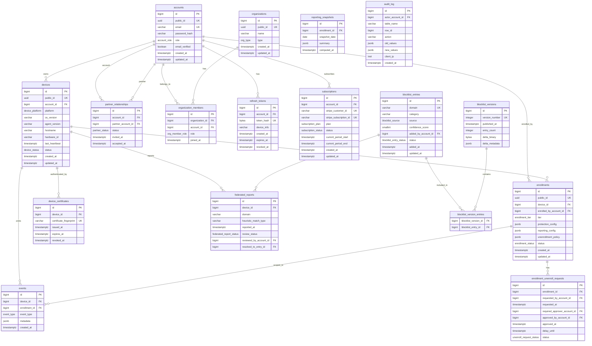

# BetBlocker -- PostgreSQL Database Schema

**Date:** 2026-03-12
**Status:** Draft
**Authors:** JD + Claude

---

## Table of Contents

1. [Overview](#1-overview)
2. [ER Diagram](#2-er-diagram)
3. [Enum Type Definitions](#3-enum-type-definitions)
4. [Extension Dependencies](#4-extension-dependencies)
5. [Schema DDL](#5-schema-ddl)
   - 5.1 [Accounts & Auth](#51-accounts--auth)
   - 5.2 [Organizations & Partnerships](#52-organizations--partnerships)
   - 5.3 [Devices & Enrollments](#53-devices--enrollments)
   - 5.4 [Blocklist](#54-blocklist)
   - 5.5 [Events & Reporting](#55-events--reporting)
   - 5.6 [Billing](#56-billing)
   - 5.7 [Audit Trail](#57-audit-trail)
6. [Row-Level Security Policies](#6-row-level-security-policies)
7. [Partitioning Strategy](#7-partitioning-strategy)
8. [TimescaleDB Hypertable Conversion](#8-timescaledb-hypertable-conversion)
9. [JSONB Schema Conventions](#9-jsonb-schema-conventions)
10. [Migration Strategy](#10-migration-strategy)

---

## 1. Overview

This document defines the complete PostgreSQL schema for BetBlocker. The schema
is designed for:

- **Multi-tenant isolation** via row-level security (RLS) keyed on `account_id`
  or `enrollment_id`.
- **High-volume event ingestion** with time-based partitioning (native range
  partitioning or TimescaleDB hypertables).
- **Deployment parity** between hosted (managed PostgreSQL) and self-hosted
  (containerized PostgreSQL) -- the same migrations run in both environments.
- **Billing optionality** -- the `subscriptions` table is created in both
  environments but only populated when the `BILLING_ENABLED` feature flag is
  set.

All timestamps are stored as `TIMESTAMPTZ` (timestamp with time zone). The
application layer normalizes to UTC on write.

Primary keys use `BIGSERIAL` (`int8`) to accommodate long-lived deployments.
UUIDs are avoided as primary keys to keep index sizes small and B-tree friendly;
UUIDs appear only where external unpredictability is required (tokens, public
identifiers).

---

## 2. ER Diagram



---

## 3. Enum Type Definitions

```sql
-- ============================================================
-- ENUM TYPES
-- ============================================================

-- Account role within the platform
CREATE TYPE account_role AS ENUM (
    'user',           -- Standard individual user
    'partner',        -- Accountability partner
    'authority',      -- Court/program/institution representative
    'admin'           -- Platform administrator
);

-- Device operating system / platform
CREATE TYPE device_platform AS ENUM (
    'windows',
    'macos',
    'linux',
    'android',
    'ios'
);

-- Device lifecycle status
CREATE TYPE device_status AS ENUM (
    'pending',        -- Registered but agent not yet reporting
    'active',         -- Healthy heartbeats arriving
    'stale',          -- Heartbeat overdue (configurable threshold)
    'disabled',       -- Manually disabled by owner or authority
    'decommissioned'  -- Permanently removed
);

-- Enrollment tier -- determines unenrollment authority,
-- reporting visibility, and bypass protection level
CREATE TYPE enrollment_tier AS ENUM (
    'self',           -- Individual self-enrollment
    'partner',        -- Accountability partner enrollment
    'authority'       -- Institutional/court enrollment
);

-- Enrollment lifecycle status
CREATE TYPE enrollment_status AS ENUM (
    'active',
    'suspended',      -- Temporarily paused (authority action)
    'unenrolling',    -- Unenrollment in progress (delay period)
    'unenrolled'      -- Completed unenrollment
);

-- Unenrollment request status
CREATE TYPE unenroll_request_status AS ENUM (
    'pending',        -- Awaiting approval or delay expiry
    'approved',       -- Approved by required authority
    'denied',         -- Denied by required authority
    'expired',        -- Delay elapsed -- auto-approved (self tier)
    'cancelled'       -- Withdrawn by requester
);

-- Partner relationship status
CREATE TYPE partner_status AS ENUM (
    'invited',        -- Invitation sent
    'active',         -- Accepted and active
    'revoked',        -- Revoked by either party
    'expired'         -- Invitation expired
);

-- Organization type
CREATE TYPE org_type AS ENUM (
    'family',
    'therapy',
    'court',
    'enterprise'
);

-- Organization member role
CREATE TYPE org_member_role AS ENUM (
    'admin',
    'member'
);

-- Blocklist entry source
CREATE TYPE blocklist_source AS ENUM (
    'curated',        -- Manually reviewed and added
    'automated',      -- Discovered by automated pipeline
    'federated'       -- Promoted from federated reports
);

-- Blocklist entry status
CREATE TYPE blocklist_entry_status AS ENUM (
    'active',
    'review',         -- Pending human review
    'rejected'        -- Reviewed and rejected
);

-- Federated report review status
CREATE TYPE federated_report_status AS ENUM (
    'pending',
    'confirmed',      -- Confirmed as gambling, promoted to blocklist
    'rejected',       -- Not gambling
    'duplicate'       -- Already in blocklist
);

-- Event type emitted by device agents
CREATE TYPE event_type AS ENUM (
    'block',              -- Gambling access blocked
    'bypass_attempt',     -- Attempted to circumvent blocking
    'tamper',             -- Agent tampering detected
    'heartbeat',          -- Periodic health check-in
    'config_change',      -- Protection/reporting config modified
    'unenroll',           -- Unenrollment event
    'app_block',          -- Application launch blocked (Phase 2)
    'install_block',      -- App install prevented (Phase 2)
    'vpn_detected',       -- VPN/proxy detected (Phase 2)
    'extension_removed'   -- Browser extension removed (Phase 3)
);

-- Subscription plan (hosted only)
CREATE TYPE subscription_plan AS ENUM (
    'standard',       -- $10/month
    'partner',        -- $15/month (future)
    'institutional'   -- Custom pricing (future)
);

-- Subscription lifecycle status
CREATE TYPE subscription_status AS ENUM (
    'trialing',
    'active',
    'past_due',
    'canceled',
    'unpaid',
    'paused'
);

-- Audit log action
CREATE TYPE audit_action AS ENUM (
    'INSERT',
    'UPDATE',
    'DELETE'
);
```

---

## 4. Extension Dependencies

```sql
-- ============================================================
-- REQUIRED EXTENSIONS
-- ============================================================

-- UUID generation for public_id columns
CREATE EXTENSION IF NOT EXISTS "pgcrypto";

-- For trigram-based fuzzy matching on domain search in blocklist
CREATE EXTENSION IF NOT EXISTS "pg_trgm";

-- For monitoring slow queries (recommended for production)
CREATE EXTENSION IF NOT EXISTS "pg_stat_statements";

-- TimescaleDB (optional -- see section 8)
-- CREATE EXTENSION IF NOT EXISTS "timescaledb";
```

---

## 5. Schema DDL

### 5.1 Accounts & Auth

```sql
-- ============================================================
-- ACCOUNTS
-- ============================================================

CREATE TABLE accounts (
    id              BIGSERIAL PRIMARY KEY,
    public_id       UUID NOT NULL DEFAULT gen_random_uuid(),
    email           VARCHAR(255) NOT NULL,
    password_hash   VARCHAR(255) NOT NULL,  -- argon2id hash
    role            account_role NOT NULL DEFAULT 'user',
    email_verified  BOOLEAN NOT NULL DEFAULT FALSE,
    display_name    VARCHAR(100),
    created_at      TIMESTAMPTZ NOT NULL DEFAULT NOW(),
    updated_at      TIMESTAMPTZ NOT NULL DEFAULT NOW()
);

-- Unique constraints
ALTER TABLE accounts ADD CONSTRAINT uq_accounts_public_id UNIQUE (public_id);
ALTER TABLE accounts ADD CONSTRAINT uq_accounts_email UNIQUE (email);

-- Indexes
CREATE INDEX idx_accounts_role ON accounts (role);
CREATE INDEX idx_accounts_created_at ON accounts (created_at DESC);

-- The public_id is used in all API responses and URLs.
-- The internal bigint id is used for joins and foreign keys.

-- ============================================================
-- REFRESH TOKENS
-- ============================================================

CREATE TABLE refresh_tokens (
    id              BIGSERIAL PRIMARY KEY,
    account_id      BIGINT NOT NULL REFERENCES accounts(id) ON DELETE CASCADE,
    token_hash      BYTEA NOT NULL,         -- SHA-256 of the actual token
    device_info     VARCHAR(500),           -- User-Agent or device description
    created_at      TIMESTAMPTZ NOT NULL DEFAULT NOW(),
    expires_at      TIMESTAMPTZ NOT NULL,
    revoked_at      TIMESTAMPTZ            -- NULL = active, set = revoked
);

-- Unique on token_hash to prevent duplicates and enable fast lookup
ALTER TABLE refresh_tokens ADD CONSTRAINT uq_refresh_tokens_hash UNIQUE (token_hash);

-- Find active tokens for an account (for revocation)
CREATE INDEX idx_refresh_tokens_account_id ON refresh_tokens (account_id);

-- Cleanup job: find expired tokens
CREATE INDEX idx_refresh_tokens_expires_at ON refresh_tokens (expires_at)
    WHERE revoked_at IS NULL;
```

### 5.2 Organizations & Partnerships

```sql
-- ============================================================
-- PARTNER RELATIONSHIPS
-- ============================================================

CREATE TABLE partner_relationships (
    id                  BIGSERIAL PRIMARY KEY,
    account_id          BIGINT NOT NULL REFERENCES accounts(id) ON DELETE CASCADE,
    partner_account_id  BIGINT NOT NULL REFERENCES accounts(id) ON DELETE CASCADE,
    status              partner_status NOT NULL DEFAULT 'invited',
    invited_at          TIMESTAMPTZ NOT NULL DEFAULT NOW(),
    accepted_at         TIMESTAMPTZ,

    -- A user cannot partner with themselves
    CONSTRAINT chk_partner_not_self CHECK (account_id <> partner_account_id)
);

-- Prevent duplicate partnership in either direction
CREATE UNIQUE INDEX uq_partner_pair
    ON partner_relationships (LEAST(account_id, partner_account_id),
                              GREATEST(account_id, partner_account_id));

-- Find partnerships for a given account
CREATE INDEX idx_partner_relationships_account ON partner_relationships (account_id);
CREATE INDEX idx_partner_relationships_partner ON partner_relationships (partner_account_id);

-- Find pending invitations
CREATE INDEX idx_partner_relationships_pending
    ON partner_relationships (partner_account_id, invited_at DESC)
    WHERE status = 'invited';

-- ============================================================
-- ORGANIZATIONS
-- ============================================================

CREATE TABLE organizations (
    id          BIGSERIAL PRIMARY KEY,
    public_id   UUID NOT NULL DEFAULT gen_random_uuid(),
    name        VARCHAR(200) NOT NULL,
    type        org_type NOT NULL,
    created_at  TIMESTAMPTZ NOT NULL DEFAULT NOW(),
    updated_at  TIMESTAMPTZ NOT NULL DEFAULT NOW()
);

ALTER TABLE organizations ADD CONSTRAINT uq_organizations_public_id UNIQUE (public_id);

CREATE INDEX idx_organizations_type ON organizations (type);

-- ============================================================
-- ORGANIZATION MEMBERS
-- ============================================================

CREATE TABLE organization_members (
    id              BIGSERIAL PRIMARY KEY,
    organization_id BIGINT NOT NULL REFERENCES organizations(id) ON DELETE CASCADE,
    account_id      BIGINT NOT NULL REFERENCES accounts(id) ON DELETE CASCADE,
    role            org_member_role NOT NULL DEFAULT 'member',
    joined_at       TIMESTAMPTZ NOT NULL DEFAULT NOW()
);

-- One membership per account per org
CREATE UNIQUE INDEX uq_org_member
    ON organization_members (organization_id, account_id);

-- Find orgs for an account
CREATE INDEX idx_org_members_account ON organization_members (account_id);

-- Find members of an org (for dashboards)
CREATE INDEX idx_org_members_org_role ON organization_members (organization_id, role);
```

### 5.3 Devices & Enrollments

```sql
-- ============================================================
-- DEVICES
-- ============================================================

CREATE TABLE devices (
    id              BIGSERIAL PRIMARY KEY,
    public_id       UUID NOT NULL DEFAULT gen_random_uuid(),
    account_id      BIGINT NOT NULL REFERENCES accounts(id) ON DELETE CASCADE,
    platform        device_platform NOT NULL,
    os_version      VARCHAR(50),
    agent_version   VARCHAR(50),
    hostname        VARCHAR(255),
    hardware_id     VARCHAR(255),       -- Platform-specific hardware fingerprint
    last_heartbeat  TIMESTAMPTZ,
    status          device_status NOT NULL DEFAULT 'pending',
    created_at      TIMESTAMPTZ NOT NULL DEFAULT NOW(),
    updated_at      TIMESTAMPTZ NOT NULL DEFAULT NOW()
);

ALTER TABLE devices ADD CONSTRAINT uq_devices_public_id UNIQUE (public_id);

-- Primary lookup: devices owned by an account
CREATE INDEX idx_devices_account_id ON devices (account_id);

-- Stale heartbeat detection (background worker query)
CREATE INDEX idx_devices_heartbeat_active
    ON devices (last_heartbeat ASC NULLS FIRST)
    WHERE status = 'active';

-- Hardware deduplication check
CREATE INDEX idx_devices_hardware_id ON devices (hardware_id)
    WHERE hardware_id IS NOT NULL;

-- Platform analytics
CREATE INDEX idx_devices_platform ON devices (platform);

-- ============================================================
-- DEVICE CERTIFICATES
-- ============================================================

CREATE TABLE device_certificates (
    id                      BIGSERIAL PRIMARY KEY,
    device_id               BIGINT NOT NULL REFERENCES devices(id) ON DELETE CASCADE,
    certificate_fingerprint VARCHAR(128) NOT NULL,  -- SHA-256 hex of cert
    issued_at               TIMESTAMPTZ NOT NULL DEFAULT NOW(),
    expires_at              TIMESTAMPTZ NOT NULL,
    revoked_at              TIMESTAMPTZ
);

ALTER TABLE device_certificates
    ADD CONSTRAINT uq_device_cert_fingerprint UNIQUE (certificate_fingerprint);

-- Find active cert for a device (mTLS validation)
CREATE INDEX idx_device_certs_device_active
    ON device_certificates (device_id)
    WHERE revoked_at IS NULL;

-- Expiry monitoring
CREATE INDEX idx_device_certs_expires
    ON device_certificates (expires_at)
    WHERE revoked_at IS NULL;

-- ============================================================
-- ENROLLMENTS
-- ============================================================

CREATE TABLE enrollments (
    id                      BIGSERIAL PRIMARY KEY,
    public_id               UUID NOT NULL DEFAULT gen_random_uuid(),
    device_id               BIGINT NOT NULL REFERENCES devices(id) ON DELETE CASCADE,
    enrolled_by_account_id  BIGINT NOT NULL REFERENCES accounts(id) ON DELETE RESTRICT,
    tier                    enrollment_tier NOT NULL,
    protection_config       JSONB NOT NULL DEFAULT '{}',
    reporting_config        JSONB NOT NULL DEFAULT '{}',
    unenrollment_policy     JSONB NOT NULL DEFAULT '{}',
    status                  enrollment_status NOT NULL DEFAULT 'active',
    created_at              TIMESTAMPTZ NOT NULL DEFAULT NOW(),
    updated_at              TIMESTAMPTZ NOT NULL DEFAULT NOW()
);

ALTER TABLE enrollments ADD CONSTRAINT uq_enrollments_public_id UNIQUE (public_id);

-- A device should have at most one active enrollment
CREATE UNIQUE INDEX uq_enrollments_device_active
    ON enrollments (device_id)
    WHERE status = 'active';

-- Find enrollments managed by a given authority
CREATE INDEX idx_enrollments_enrolled_by
    ON enrollments (enrolled_by_account_id);

-- Dashboard queries: active enrollments by tier
CREATE INDEX idx_enrollments_tier_status
    ON enrollments (tier, status);

-- Device lookup for active enrollment
CREATE INDEX idx_enrollments_device_status
    ON enrollments (device_id, status);

-- ============================================================
-- ENROLLMENT UNENROLL REQUESTS
-- ============================================================

CREATE TABLE enrollment_unenroll_requests (
    id                          BIGSERIAL PRIMARY KEY,
    enrollment_id               BIGINT NOT NULL REFERENCES enrollments(id) ON DELETE CASCADE,
    requested_by_account_id     BIGINT NOT NULL REFERENCES accounts(id) ON DELETE CASCADE,
    requested_at                TIMESTAMPTZ NOT NULL DEFAULT NOW(),
    required_approver_account_id BIGINT REFERENCES accounts(id) ON DELETE SET NULL,
    approved_by_account_id      BIGINT REFERENCES accounts(id) ON DELETE SET NULL,
    approved_at                 TIMESTAMPTZ,
    delay_until                 TIMESTAMPTZ,  -- For self-tier time-delayed unenrollment
    status                      unenroll_request_status NOT NULL DEFAULT 'pending'
);

-- Only one pending request per enrollment at a time
CREATE UNIQUE INDEX uq_unenroll_request_pending
    ON enrollment_unenroll_requests (enrollment_id)
    WHERE status = 'pending';

-- Find requests awaiting a specific approver
CREATE INDEX idx_unenroll_requests_approver
    ON enrollment_unenroll_requests (required_approver_account_id)
    WHERE status = 'pending';

-- Background worker: find delay-expired self-tier requests
CREATE INDEX idx_unenroll_requests_delay
    ON enrollment_unenroll_requests (delay_until)
    WHERE status = 'pending' AND delay_until IS NOT NULL;
```

### 5.4 Blocklist

```sql
-- ============================================================
-- BLOCKLIST ENTRIES
-- ============================================================

CREATE TABLE blocklist_entries (
    id                  BIGSERIAL PRIMARY KEY,
    domain              VARCHAR(500) NOT NULL,
    category            VARCHAR(100),       -- e.g., 'casino', 'sports_betting', 'lottery'
    source              blocklist_source NOT NULL DEFAULT 'curated',
    confidence_score    SMALLINT NOT NULL DEFAULT 100
                        CONSTRAINT chk_confidence CHECK (confidence_score BETWEEN 0 AND 100),
    added_by_account_id BIGINT REFERENCES accounts(id) ON DELETE SET NULL,
    status              blocklist_entry_status NOT NULL DEFAULT 'active',
    added_at            TIMESTAMPTZ NOT NULL DEFAULT NOW(),
    updated_at          TIMESTAMPTZ NOT NULL DEFAULT NOW()
);

-- Domain is unique -- no duplicates in the blocklist
ALTER TABLE blocklist_entries ADD CONSTRAINT uq_blocklist_domain UNIQUE (domain);

-- Trigram index for fuzzy domain search in admin panel
CREATE INDEX idx_blocklist_domain_trgm
    ON blocklist_entries USING gin (domain gin_trgm_ops);

-- Category filter
CREATE INDEX idx_blocklist_category ON blocklist_entries (category)
    WHERE status = 'active';

-- Review queue: pending entries sorted by recency
CREATE INDEX idx_blocklist_review_queue
    ON blocklist_entries (added_at DESC)
    WHERE status = 'review';

-- Source breakdown for analytics
CREATE INDEX idx_blocklist_source ON blocklist_entries (source);

-- ============================================================
-- BLOCKLIST VERSIONS
-- ============================================================

CREATE TABLE blocklist_versions (
    id                  BIGSERIAL PRIMARY KEY,
    version_number      INTEGER NOT NULL,
    published_at        TIMESTAMPTZ NOT NULL DEFAULT NOW(),
    entry_count         INTEGER NOT NULL DEFAULT 0,
    -- Binary delta payload (compressed). Agents download this for incremental sync.
    delta_binary        BYTEA,
    -- Metadata about the delta (entries added, removed, stats).
    delta_metadata      JSONB NOT NULL DEFAULT '{}'
);

ALTER TABLE blocklist_versions
    ADD CONSTRAINT uq_blocklist_version_number UNIQUE (version_number);

-- Fast lookup of latest version
CREATE INDEX idx_blocklist_versions_published
    ON blocklist_versions (published_at DESC);

-- ============================================================
-- BLOCKLIST VERSION <-> ENTRY MAPPING (for full version snapshots)
-- ============================================================

CREATE TABLE blocklist_version_entries (
    blocklist_version_id BIGINT NOT NULL REFERENCES blocklist_versions(id) ON DELETE CASCADE,
    blocklist_entry_id   BIGINT NOT NULL REFERENCES blocklist_entries(id) ON DELETE CASCADE,
    PRIMARY KEY (blocklist_version_id, blocklist_entry_id)
);

-- Reverse lookup: which versions include a given entry
CREATE INDEX idx_bve_entry ON blocklist_version_entries (blocklist_entry_id);

-- ============================================================
-- FEDERATED REPORTS
-- ============================================================

CREATE TABLE federated_reports (
    id                      BIGSERIAL PRIMARY KEY,
    device_id               BIGINT NOT NULL REFERENCES devices(id) ON DELETE CASCADE,
    domain                  VARCHAR(500) NOT NULL,
    heuristic_match_type    VARCHAR(100),   -- e.g., 'keyword', 'visual', 'dns_pattern'
    reported_at             TIMESTAMPTZ NOT NULL DEFAULT NOW(),
    review_status           federated_report_status NOT NULL DEFAULT 'pending',
    reviewed_by_account_id  BIGINT REFERENCES accounts(id) ON DELETE SET NULL,
    resolved_to_entry_id    BIGINT REFERENCES blocklist_entries(id) ON DELETE SET NULL
);

-- Review queue sorted by recency
CREATE INDEX idx_federated_reports_pending
    ON federated_reports (reported_at DESC)
    WHERE review_status = 'pending';

-- Aggregate reports by domain to see frequency (popularity = priority)
CREATE INDEX idx_federated_reports_domain
    ON federated_reports (domain);

-- Find reports from a specific device
CREATE INDEX idx_federated_reports_device
    ON federated_reports (device_id);
```

### 5.5 Events & Reporting

```sql
-- ============================================================
-- EVENTS (partitioned by month)
-- ============================================================
--
-- This is the highest-volume table. At scale, expect millions of rows
-- per day (heartbeats alone: 1 per device per 5 minutes).
--
-- Strategy: native PostgreSQL range partitioning on created_at.
-- See section 7 for partition management details.
-- See section 8 for optional TimescaleDB conversion.

CREATE TABLE events (
    id              BIGSERIAL,
    device_id       BIGINT NOT NULL,
    enrollment_id   BIGINT,
    event_type      event_type NOT NULL,
    metadata        JSONB NOT NULL DEFAULT '{}',
    created_at      TIMESTAMPTZ NOT NULL DEFAULT NOW(),

    -- Composite primary key required for partitioned tables
    PRIMARY KEY (id, created_at)
) PARTITION BY RANGE (created_at);

-- Foreign keys cannot reference partitioned tables easily,
-- so we enforce referential integrity at the application layer
-- for events. The device_id and enrollment_id are validated
-- before insert by the API.

-- Create initial partitions (extend via migration or cron)
CREATE TABLE events_y2026m01 PARTITION OF events
    FOR VALUES FROM ('2026-01-01') TO ('2026-02-01');
CREATE TABLE events_y2026m02 PARTITION OF events
    FOR VALUES FROM ('2026-02-01') TO ('2026-03-01');
CREATE TABLE events_y2026m03 PARTITION OF events
    FOR VALUES FROM ('2026-03-01') TO ('2026-04-01');
CREATE TABLE events_y2026m04 PARTITION OF events
    FOR VALUES FROM ('2026-04-01') TO ('2026-05-01');
CREATE TABLE events_y2026m05 PARTITION OF events
    FOR VALUES FROM ('2026-05-01') TO ('2026-06-01');
CREATE TABLE events_y2026m06 PARTITION OF events
    FOR VALUES FROM ('2026-06-01') TO ('2026-07-01');
CREATE TABLE events_y2026m07 PARTITION OF events
    FOR VALUES FROM ('2026-07-01') TO ('2026-08-01');
CREATE TABLE events_y2026m08 PARTITION OF events
    FOR VALUES FROM ('2026-08-01') TO ('2026-09-01');
CREATE TABLE events_y2026m09 PARTITION OF events
    FOR VALUES FROM ('2026-09-01') TO ('2026-10-01');
CREATE TABLE events_y2026m10 PARTITION OF events
    FOR VALUES FROM ('2026-10-01') TO ('2026-11-01');
CREATE TABLE events_y2026m11 PARTITION OF events
    FOR VALUES FROM ('2026-11-01') TO ('2026-12-01');
CREATE TABLE events_y2026m12 PARTITION OF events
    FOR VALUES FROM ('2026-12-01') TO ('2027-01-01');

-- Indexes on partitioned table (automatically created on each partition)

-- Dashboard: events for a specific device, recent first
CREATE INDEX idx_events_device_created
    ON events (device_id, created_at DESC);

-- Dashboard: events for a specific enrollment, recent first
CREATE INDEX idx_events_enrollment_created
    ON events (enrollment_id, created_at DESC)
    WHERE enrollment_id IS NOT NULL;

-- Filtering by event type within a time range
CREATE INDEX idx_events_type_created
    ON events (event_type, created_at DESC);

-- Tamper and bypass alerts (high priority events for real-time alerting)
CREATE INDEX idx_events_alerts
    ON events (device_id, created_at DESC)
    WHERE event_type IN ('bypass_attempt', 'tamper', 'vpn_detected', 'extension_removed');

-- ============================================================
-- REPORTING SNAPSHOTS
-- ============================================================
--
-- Pre-aggregated daily summaries per enrollment. Computed by the
-- background worker. Dashboard queries hit this table instead
-- of scanning the events table.

CREATE TABLE reporting_snapshots (
    id              BIGSERIAL PRIMARY KEY,
    enrollment_id   BIGINT NOT NULL REFERENCES enrollments(id) ON DELETE CASCADE,
    snapshot_date   DATE NOT NULL,
    summary         JSONB NOT NULL DEFAULT '{}',
    computed_at     TIMESTAMPTZ NOT NULL DEFAULT NOW()
);

-- One snapshot per enrollment per day
CREATE UNIQUE INDEX uq_reporting_snapshot
    ON reporting_snapshots (enrollment_id, snapshot_date);

-- Date range queries for dashboards
CREATE INDEX idx_reporting_snapshots_date
    ON reporting_snapshots (snapshot_date DESC);
```

### 5.6 Billing

```sql
-- ============================================================
-- SUBSCRIPTIONS (hosted deployment only)
-- ============================================================
--
-- This table is created in all environments but only populated
-- when BILLING_ENABLED=true. Application code checks the flag
-- before querying this table.

CREATE TABLE subscriptions (
    id                      BIGSERIAL PRIMARY KEY,
    account_id              BIGINT NOT NULL REFERENCES accounts(id) ON DELETE CASCADE,
    stripe_customer_id      VARCHAR(255) NOT NULL,
    stripe_subscription_id  VARCHAR(255) NOT NULL,
    plan                    subscription_plan NOT NULL DEFAULT 'standard',
    status                  subscription_status NOT NULL DEFAULT 'active',
    current_period_start    TIMESTAMPTZ NOT NULL,
    current_period_end      TIMESTAMPTZ NOT NULL,
    created_at              TIMESTAMPTZ NOT NULL DEFAULT NOW(),
    updated_at              TIMESTAMPTZ NOT NULL DEFAULT NOW()
);

ALTER TABLE subscriptions
    ADD CONSTRAINT uq_subscriptions_stripe_customer UNIQUE (stripe_customer_id);
ALTER TABLE subscriptions
    ADD CONSTRAINT uq_subscriptions_stripe_sub UNIQUE (stripe_subscription_id);

-- One active subscription per account
CREATE UNIQUE INDEX uq_subscriptions_account_active
    ON subscriptions (account_id)
    WHERE status IN ('active', 'trialing', 'past_due');

-- Webhook lookup by Stripe IDs
CREATE INDEX idx_subscriptions_stripe_customer
    ON subscriptions (stripe_customer_id);

-- Renewal processing
CREATE INDEX idx_subscriptions_period_end
    ON subscriptions (current_period_end)
    WHERE status = 'active';
```

### 5.7 Audit Trail

```sql
-- ============================================================
-- AUDIT LOG
-- ============================================================
--
-- Captures all mutations to security-critical tables. Populated
-- by triggers (see below). This table is append-only -- no
-- UPDATE or DELETE is permitted at the application level.
--
-- For authority-tier compliance, this table provides the full
-- audit trail of who changed what, when, and from where.

CREATE TABLE audit_log (
    id                  BIGSERIAL PRIMARY KEY,
    actor_account_id    BIGINT REFERENCES accounts(id) ON DELETE SET NULL,
    table_name          VARCHAR(100) NOT NULL,
    row_id              BIGINT NOT NULL,
    action              audit_action NOT NULL,
    old_values          JSONB,
    new_values          JSONB,
    client_ip           INET,
    created_at          TIMESTAMPTZ NOT NULL DEFAULT NOW()
);

-- Query audit log for a specific table/row (compliance review)
CREATE INDEX idx_audit_log_table_row
    ON audit_log (table_name, row_id, created_at DESC);

-- Query audit log by actor (who did what)
CREATE INDEX idx_audit_log_actor
    ON audit_log (actor_account_id, created_at DESC)
    WHERE actor_account_id IS NOT NULL;

-- Time range scans for export
CREATE INDEX idx_audit_log_created
    ON audit_log (created_at DESC);

-- ============================================================
-- AUDIT TRIGGER FUNCTION
-- ============================================================
--
-- Generic trigger that logs INSERT, UPDATE, and DELETE operations.
-- The application sets session variables for actor context:
--
--   SET LOCAL app.current_account_id = '42';
--   SET LOCAL app.current_ip = '192.168.1.1';
--
-- These are read inside the trigger to populate actor_account_id
-- and client_ip.

CREATE OR REPLACE FUNCTION fn_audit_trigger()
RETURNS TRIGGER AS $$
DECLARE
    v_actor   BIGINT;
    v_ip      INET;
    v_old     JSONB;
    v_new     JSONB;
    v_row_id  BIGINT;
BEGIN
    -- Read application context (set via SET LOCAL in the transaction)
    BEGIN
        v_actor := current_setting('app.current_account_id')::BIGINT;
    EXCEPTION WHEN OTHERS THEN
        v_actor := NULL;
    END;

    BEGIN
        v_ip := current_setting('app.current_ip')::INET;
    EXCEPTION WHEN OTHERS THEN
        v_ip := NULL;
    END;

    IF TG_OP = 'DELETE' THEN
        v_old := to_jsonb(OLD);
        v_new := NULL;
        v_row_id := OLD.id;
    ELSIF TG_OP = 'UPDATE' THEN
        v_old := to_jsonb(OLD);
        v_new := to_jsonb(NEW);
        v_row_id := NEW.id;
    ELSIF TG_OP = 'INSERT' THEN
        v_old := NULL;
        v_new := to_jsonb(NEW);
        v_row_id := NEW.id;
    END IF;

    INSERT INTO audit_log (actor_account_id, table_name, row_id, action, old_values, new_values, client_ip)
    VALUES (v_actor, TG_TABLE_NAME, v_row_id, TG_OP::audit_action, v_old, v_new, v_ip);

    RETURN COALESCE(NEW, OLD);
END;
$$ LANGUAGE plpgsql SECURITY DEFINER;

-- ============================================================
-- ATTACH AUDIT TRIGGERS TO SECURITY-CRITICAL TABLES
-- ============================================================

CREATE TRIGGER trg_audit_accounts
    AFTER INSERT OR UPDATE OR DELETE ON accounts
    FOR EACH ROW EXECUTE FUNCTION fn_audit_trigger();

CREATE TRIGGER trg_audit_enrollments
    AFTER INSERT OR UPDATE OR DELETE ON enrollments
    FOR EACH ROW EXECUTE FUNCTION fn_audit_trigger();

CREATE TRIGGER trg_audit_enrollment_unenroll_requests
    AFTER INSERT OR UPDATE OR DELETE ON enrollment_unenroll_requests
    FOR EACH ROW EXECUTE FUNCTION fn_audit_trigger();

CREATE TRIGGER trg_audit_devices
    AFTER INSERT OR UPDATE OR DELETE ON devices
    FOR EACH ROW EXECUTE FUNCTION fn_audit_trigger();

CREATE TRIGGER trg_audit_device_certificates
    AFTER INSERT OR UPDATE OR DELETE ON device_certificates
    FOR EACH ROW EXECUTE FUNCTION fn_audit_trigger();

CREATE TRIGGER trg_audit_partner_relationships
    AFTER INSERT OR UPDATE OR DELETE ON partner_relationships
    FOR EACH ROW EXECUTE FUNCTION fn_audit_trigger();

CREATE TRIGGER trg_audit_organization_members
    AFTER INSERT OR UPDATE OR DELETE ON organization_members
    FOR EACH ROW EXECUTE FUNCTION fn_audit_trigger();

CREATE TRIGGER trg_audit_blocklist_entries
    AFTER INSERT OR UPDATE OR DELETE ON blocklist_entries
    FOR EACH ROW EXECUTE FUNCTION fn_audit_trigger();

CREATE TRIGGER trg_audit_subscriptions
    AFTER INSERT OR UPDATE OR DELETE ON subscriptions
    FOR EACH ROW EXECUTE FUNCTION fn_audit_trigger();
```

---

## 6. Row-Level Security Policies

Row-level security enforces multi-tenant isolation at the database level. Even
if application code has a bug, one account cannot read another account's data.

The API connects as the `betblocker_api` role and sets session variables per
request:

```sql
SET LOCAL app.current_account_id = '42';
SET LOCAL app.current_role = 'user';
```

### RLS Setup

```sql
-- ============================================================
-- APPLICATION ROLE
-- ============================================================

-- The API connects as this role. It has no superuser privileges.
-- RLS policies control what rows it can see.

-- CREATE ROLE betblocker_api LOGIN PASSWORD '...';  -- set in deployment config
-- GRANT USAGE ON SCHEMA public TO betblocker_api;
-- GRANT SELECT, INSERT, UPDATE, DELETE ON ALL TABLES IN SCHEMA public TO betblocker_api;
-- GRANT USAGE, SELECT ON ALL SEQUENCES IN SCHEMA public TO betblocker_api;

-- ============================================================
-- ENABLE RLS ON TENANT-SCOPED TABLES
-- ============================================================

ALTER TABLE accounts ENABLE ROW LEVEL SECURITY;
ALTER TABLE devices ENABLE ROW LEVEL SECURITY;
ALTER TABLE enrollments ENABLE ROW LEVEL SECURITY;
ALTER TABLE enrollment_unenroll_requests ENABLE ROW LEVEL SECURITY;
ALTER TABLE partner_relationships ENABLE ROW LEVEL SECURITY;
ALTER TABLE refresh_tokens ENABLE ROW LEVEL SECURITY;
ALTER TABLE device_certificates ENABLE ROW LEVEL SECURITY;
ALTER TABLE subscriptions ENABLE ROW LEVEL SECURITY;
ALTER TABLE reporting_snapshots ENABLE ROW LEVEL SECURITY;

-- ============================================================
-- HELPER FUNCTION: current account ID from session
-- ============================================================

CREATE OR REPLACE FUNCTION current_account_id() RETURNS BIGINT AS $$
BEGIN
    RETURN current_setting('app.current_account_id', true)::BIGINT;
EXCEPTION WHEN OTHERS THEN
    RETURN NULL;
END;
$$ LANGUAGE plpgsql STABLE;

CREATE OR REPLACE FUNCTION current_account_role() RETURNS TEXT AS $$
BEGIN
    RETURN current_setting('app.current_role', true);
EXCEPTION WHEN OTHERS THEN
    RETURN NULL;
END;
$$ LANGUAGE plpgsql STABLE;

-- ============================================================
-- POLICIES
-- ============================================================

-- ACCOUNTS: users see only their own row; admins see all
CREATE POLICY accounts_self ON accounts
    FOR ALL
    USING (
        id = current_account_id()
        OR current_account_role() = 'admin'
    );

-- DEVICES: owners see their own devices; partners/authorities see devices
-- they have active enrollments on; admins see all
CREATE POLICY devices_owner ON devices
    FOR ALL
    USING (
        account_id = current_account_id()
        OR EXISTS (
            SELECT 1 FROM enrollments e
            WHERE e.device_id = devices.id
              AND e.enrolled_by_account_id = current_account_id()
              AND e.status = 'active'
        )
        OR current_account_role() = 'admin'
    );

-- ENROLLMENTS: device owner or enrollment authority can see the enrollment
CREATE POLICY enrollments_access ON enrollments
    FOR ALL
    USING (
        enrolled_by_account_id = current_account_id()
        OR EXISTS (
            SELECT 1 FROM devices d
            WHERE d.id = enrollments.device_id
              AND d.account_id = current_account_id()
        )
        OR current_account_role() = 'admin'
    );

-- ENROLLMENT UNENROLL REQUESTS: requester, required approver, or admin
CREATE POLICY unenroll_requests_access ON enrollment_unenroll_requests
    FOR ALL
    USING (
        requested_by_account_id = current_account_id()
        OR required_approver_account_id = current_account_id()
        OR current_account_role() = 'admin'
    );

-- PARTNER RELATIONSHIPS: either party
CREATE POLICY partner_relationships_access ON partner_relationships
    FOR ALL
    USING (
        account_id = current_account_id()
        OR partner_account_id = current_account_id()
        OR current_account_role() = 'admin'
    );

-- REFRESH TOKENS: own tokens only
CREATE POLICY refresh_tokens_self ON refresh_tokens
    FOR ALL
    USING (
        account_id = current_account_id()
        OR current_account_role() = 'admin'
    );

-- DEVICE CERTIFICATES: device owner or enrollment authority
CREATE POLICY device_certs_access ON device_certificates
    FOR ALL
    USING (
        EXISTS (
            SELECT 1 FROM devices d
            WHERE d.id = device_certificates.device_id
              AND (
                  d.account_id = current_account_id()
                  OR EXISTS (
                      SELECT 1 FROM enrollments e
                      WHERE e.device_id = d.id
                        AND e.enrolled_by_account_id = current_account_id()
                        AND e.status = 'active'
                  )
              )
        )
        OR current_account_role() = 'admin'
    );

-- SUBSCRIPTIONS: own subscription only
CREATE POLICY subscriptions_self ON subscriptions
    FOR ALL
    USING (
        account_id = current_account_id()
        OR current_account_role() = 'admin'
    );

-- REPORTING SNAPSHOTS: accessible via enrollment visibility
CREATE POLICY reporting_snapshots_access ON reporting_snapshots
    FOR ALL
    USING (
        EXISTS (
            SELECT 1 FROM enrollments e
            WHERE e.id = reporting_snapshots.enrollment_id
              AND (
                  e.enrolled_by_account_id = current_account_id()
                  OR EXISTS (
                      SELECT 1 FROM devices d
                      WHERE d.id = e.device_id
                        AND d.account_id = current_account_id()
                  )
              )
        )
        OR current_account_role() = 'admin'
    );

-- NOTE: The following tables do NOT have RLS because they are
-- not tenant-scoped (shared resources):
--   - organizations (access controlled via organization_members)
--   - organization_members (application-level checks)
--   - blocklist_entries (global, read by all)
--   - blocklist_versions (global, read by all)
--   - blocklist_version_entries (global, read by all)
--   - federated_reports (admin-only review queue)
--   - events (partitioned table -- RLS on partitioned tables is
--     supported but adds overhead; application-layer filtering
--     via enrollment visibility is preferred for events)
--   - audit_log (admin-only, append-only)
```

---

## 7. Partitioning Strategy

### Events Table

The `events` table uses **native PostgreSQL range partitioning** on the
`created_at` column, with monthly partitions.

**Partition management:**

- A background worker or cron job creates partitions 3 months ahead.
- Old partitions (beyond the retention window) are detached and optionally
  dropped or archived to cold storage.
- Default retention: 12 months of hot data. Authority-tier enrollments may
  require longer retention (configurable per deployment).

**Partition creation template:**

```sql
-- Run monthly via cron or background worker
-- Example: create partition for July 2026
CREATE TABLE IF NOT EXISTS events_y2026m07 PARTITION OF events
    FOR VALUES FROM ('2026-07-01') TO ('2026-08-01');
```

**Partition maintenance:**

```sql
-- Detach old partitions (non-blocking in PG 14+)
ALTER TABLE events DETACH PARTITION events_y2025m01 CONCURRENTLY;

-- Optionally archive to S3/GCS before dropping
-- pg_dump --table=events_y2025m01 | gzip > events_y2025m01.sql.gz

-- Then drop
DROP TABLE events_y2025m01;
```

**Why monthly?**

- Monthly partitions balance partition count (manageable) against partition
  size (small enough for efficient pruning).
- Most dashboard queries filter by date range, so partition pruning eliminates
  the majority of data from scans.
- Heartbeat events alone generate ~288 rows per device per day (at 5-minute
  intervals). At 10,000 devices this is 2.88M rows/day, or ~86M rows/month.
  Monthly partitions keep each partition under ~100M rows.

### Audit Log Table

The `audit_log` table is a candidate for partitioning if it grows large. For
MVP, it remains unpartitioned. If compliance requirements demand long retention
and the table exceeds ~100M rows, partition it by month using the same strategy
as events.

---

## 8. TimescaleDB Hypertable Conversion

For deployments using TimescaleDB (recommended for analytics-heavy workloads),
the events table can be converted to a hypertable instead of using native
partitioning.

**Conversion approach:**

```sql
-- 1. Create the events table WITHOUT the PARTITION BY clause
CREATE TABLE events (
    id              BIGSERIAL,
    device_id       BIGINT NOT NULL,
    enrollment_id   BIGINT,
    event_type      event_type NOT NULL,
    metadata        JSONB NOT NULL DEFAULT '{}',
    created_at      TIMESTAMPTZ NOT NULL DEFAULT NOW(),
    PRIMARY KEY (id, created_at)
);

-- 2. Convert to hypertable (7-day chunks for high-volume)
SELECT create_hypertable('events', 'created_at',
    chunk_time_interval => INTERVAL '7 days',
    migrate_data => true
);

-- 3. Enable compression (after 30 days)
ALTER TABLE events SET (
    timescaledb.compress,
    timescaledb.compress_segmentby = 'device_id, enrollment_id',
    timescaledb.compress_orderby = 'created_at DESC'
);

-- 4. Add compression policy
SELECT add_compression_policy('events', INTERVAL '30 days');

-- 5. Add retention policy (optional -- drop chunks older than 12 months)
SELECT add_retention_policy('events', INTERVAL '12 months');
```

**Benefits over native partitioning:**

- Automatic chunk management (no cron job to create partitions).
- Native compression reduces storage by 90%+ for older data.
- Continuous aggregates can replace `reporting_snapshots` for some use cases.
- Built-in retention policies.

**Continuous aggregate example (replaces some reporting_snapshot queries):**

```sql
CREATE MATERIALIZED VIEW daily_event_summary
WITH (timescaledb.continuous) AS
SELECT
    time_bucket('1 day', created_at) AS bucket,
    enrollment_id,
    event_type,
    COUNT(*) AS event_count
FROM events
WHERE enrollment_id IS NOT NULL
GROUP BY bucket, enrollment_id, event_type;

-- Refresh policy: refresh daily, covering the last 3 days
SELECT add_continuous_aggregate_policy('daily_event_summary',
    start_offset    => INTERVAL '3 days',
    end_offset      => INTERVAL '1 hour',
    schedule_interval => INTERVAL '1 day'
);
```

**Decision guidance:**

- Self-hosted deployments with fewer than 10,000 devices: native partitioning
  is sufficient.
- Hosted deployment or large self-hosted: use TimescaleDB for compression and
  continuous aggregates.
- The migration path is well-documented: create the table without
  `PARTITION BY`, then call `create_hypertable()`. All existing indexes and
  queries work unchanged.

---

## 9. JSONB Schema Conventions

Three JSONB columns carry structured configuration. While PostgreSQL does not
enforce a JSON schema natively, the application layer validates these against
Rust types (serde) before writing. The conventions below define the expected
shape.

### 9.1 protection_config

Stored on `enrollments.protection_config`. Defines what blocking layers are
active and their settings.

```jsonc
{
  // Which blocking layers are enabled
  "layers": {
    "dns": true,           // Layer 1: DNS/network blocking (always true)
    "application": false,  // Layer 2: App blocking (Phase 2)
    "browser": false       // Layer 3: Browser/content blocking (Phase 3)
  },

  // DNS blocking settings
  "dns": {
    "block_response": "nxdomain",     // "nxdomain" | "redirect"
    "redirect_url": null,             // URL for interstitial page (if redirect)
    "block_doh": true,                // Block DNS-over-HTTPS
    "block_dot": true,                // Block DNS-over-TLS
    "hosts_file_fallback": true       // Write blocked domains to HOSTS file
  },

  // VPN/bypass detection behavior
  "bypass_detection": {
    "vpn_action": "alert",            // "log" | "alert" | "lockdown"
    "proxy_action": "alert",
    "tor_action": "lockdown"
  },

  // Heartbeat interval in seconds
  "heartbeat_interval_seconds": 300,

  // Tamper detection sensitivity
  "tamper_sensitivity": "standard"    // "standard" | "elevated" | "maximum"
}
```

### 9.2 reporting_config

Stored on `enrollments.reporting_config`. Controls what data is reported and
to whom.

```jsonc
{
  // What events are reported to the enrollment authority
  "report_to_authority": {
    "blocks": true,
    "bypass_attempts": true,
    "tamper_events": true,
    "heartbeat_status": true,
    "config_changes": true
  },

  // Aggregation level for the authority dashboard
  "aggregation_level": "aggregated",  // "aggregated" | "detailed"
  // "aggregated" = counts and categories only
  // "detailed" = individual domain names visible

  // Whether this device contributes to federated intelligence
  "federated_reporting": true,

  // Real-time alerting configuration
  "alerts": {
    "on_bypass_attempt": true,
    "on_tamper": true,
    "on_missed_heartbeat": true,
    "alert_channels": ["email"]       // "email" | "push" | "webhook"
  }
}
```

### 9.3 unenrollment_policy

Stored on `enrollments.unenrollment_policy`. Defines the rules governing how
and when unenrollment is permitted.

```jsonc
{
  // Who must approve unenrollment
  "approval_required_by": "self",     // "self" | "partner" | "authority"

  // For self-tier: mandatory delay before unenrollment takes effect
  "delay_hours": 48,                  // 24-72 range for self-tier

  // Whether the authority is notified on unenrollment request
  "notify_on_request": true,

  // For authority-tier: whether the user can even request unenrollment
  "user_can_request": true,

  // Minimum enrollment duration before unenrollment is allowed
  "minimum_enrollment_days": null,    // null = no minimum

  // Notification targets when unenrollment is requested
  "notify_accounts": [42, 99]         // account IDs to notify
}
```

### 9.4 events.metadata

The `metadata` JSONB column on `events` carries event-type-specific payload.

```jsonc
// event_type = 'block'
{
  "domain": "example-casino.com",
  "category": "casino",
  "layer": "dns",
  "query_type": "A"
}

// event_type = 'bypass_attempt'
{
  "method": "vpn_detected",       // "vpn_detected" | "dns_changed" | "proxy_set" | "tor"
  "details": "WireGuard tunnel detected on utun3"
}

// event_type = 'tamper'
{
  "type": "binary_modified",      // "binary_modified" | "service_stopped" | "config_altered"
  "integrity_hash_expected": "abc123...",
  "integrity_hash_actual": "def456..."
}

// event_type = 'heartbeat'
{
  "agent_version": "1.2.3",
  "blocklist_version": 147,
  "uptime_seconds": 86400,
  "blocked_count_since_last": 12
}

// event_type = 'config_change'
{
  "field": "protection_config.bypass_detection.vpn_action",
  "old_value": "log",
  "new_value": "alert",
  "changed_by_account_id": 42
}
```

### 9.5 reporting_snapshots.summary

Pre-aggregated daily summary per enrollment.

```jsonc
{
  "total_blocks": 47,
  "total_bypass_attempts": 2,
  "total_tamper_events": 0,
  "total_heartbeats": 288,
  "missed_heartbeats": 0,
  "top_blocked_domains": [
    {"domain": "example-casino.com", "count": 23},
    {"domain": "sports-bet.net", "count": 12}
  ],
  "blocks_by_category": {
    "casino": 30,
    "sports_betting": 15,
    "lottery": 2
  },
  "blocks_by_layer": {
    "dns": 45,
    "application": 2,
    "browser": 0
  },
  "device_status_at_end_of_day": "active"
}
```

---

## 10. Migration Strategy

### Migration Tooling

Migrations are managed using numbered SQL files, executed in order by the API
binary at startup (or by a dedicated migration runner). The Rust ecosystem
standard is `sqlx migrate` or `refinery`, both of which support numbered
migrations.

### Migration File Naming

```
migrations/
  V001__create_enums.sql
  V002__create_accounts.sql
  V003__create_refresh_tokens.sql
  V004__create_partner_relationships.sql
  V005__create_organizations.sql
  V006__create_organization_members.sql
  V007__create_devices.sql
  V008__create_device_certificates.sql
  V009__create_enrollments.sql
  V010__create_enrollment_unenroll_requests.sql
  V011__create_blocklist_entries.sql
  V012__create_blocklist_versions.sql
  V013__create_blocklist_version_entries.sql
  V014__create_federated_reports.sql
  V015__create_events_partitioned.sql
  V016__create_reporting_snapshots.sql
  V017__create_subscriptions.sql
  V018__create_audit_log.sql
  V019__create_audit_triggers.sql
  V020__create_rls_policies.sql
  V021__seed_initial_blocklist.sql
```

### Migration Principles

1. **Every migration is forward-only.** Rollback is accomplished by writing a
   new forward migration that reverses the change. This avoids the complexity of
   maintaining paired up/down scripts that can drift.

2. **No table locks in production.** Use `CREATE INDEX CONCURRENTLY` (which
   cannot run inside a transaction -- the migration runner must support
   non-transactional migrations for index creation). Use `ALTER TABLE ... ADD
   COLUMN` with defaults (PostgreSQL 11+ does not rewrite the table for this).

3. **Column drops are two-phase.** First migration: stop reading the column in
   application code and deploy. Second migration (after deploy is confirmed):
   `ALTER TABLE ... DROP COLUMN`.

4. **Enum values are append-only.** PostgreSQL `ALTER TYPE ... ADD VALUE` cannot
   run inside a transaction. Never remove or rename enum values; add new ones
   and deprecate old ones in application code.

5. **JSONB columns are schema-on-read.** New fields are added by the application
   with defaults. The database does not enforce JSONB shape. Breaking changes to
   JSONB shape require a migration that rewrites existing rows.

6. **Partition creation is automated.** The background worker creates partitions
   3 months ahead on a weekly check. This is not a migration -- it is a runtime
   operation.

### Zero-Downtime Deployment Sequence

```
1. Run migrations (additive only -- new tables, columns, indexes)
2. Deploy new API code (reads new columns, writes new columns)
3. Verify healthy
4. (If dropping columns) Run follow-up migration to drop unused columns
```

### Migration Execution

```bash
# Development
cargo sqlx migrate run --database-url postgres://...

# Production (Kubernetes init container or pre-deploy step)
betblocker-api migrate
# The API binary includes an embedded migration runner.
# On startup with --migrate flag, it runs pending migrations and exits.
```

---

## Appendix A: Updated_at Trigger

All tables with an `updated_at` column use a shared trigger to auto-update
the timestamp on row modification.

```sql
CREATE OR REPLACE FUNCTION fn_set_updated_at()
RETURNS TRIGGER AS $$
BEGIN
    NEW.updated_at = NOW();
    RETURN NEW;
END;
$$ LANGUAGE plpgsql;

CREATE TRIGGER trg_accounts_updated_at
    BEFORE UPDATE ON accounts
    FOR EACH ROW EXECUTE FUNCTION fn_set_updated_at();

CREATE TRIGGER trg_devices_updated_at
    BEFORE UPDATE ON devices
    FOR EACH ROW EXECUTE FUNCTION fn_set_updated_at();

CREATE TRIGGER trg_enrollments_updated_at
    BEFORE UPDATE ON enrollments
    FOR EACH ROW EXECUTE FUNCTION fn_set_updated_at();

CREATE TRIGGER trg_organizations_updated_at
    BEFORE UPDATE ON organizations
    FOR EACH ROW EXECUTE FUNCTION fn_set_updated_at();

CREATE TRIGGER trg_blocklist_entries_updated_at
    BEFORE UPDATE ON blocklist_entries
    FOR EACH ROW EXECUTE FUNCTION fn_set_updated_at();

CREATE TRIGGER trg_subscriptions_updated_at
    BEFORE UPDATE ON subscriptions
    FOR EACH ROW EXECUTE FUNCTION fn_set_updated_at();
```

---

## Appendix B: Useful Queries

### Find stale devices (heartbeat overdue by 15 minutes)

```sql
SELECT d.id, d.hostname, d.last_heartbeat, d.account_id
FROM devices d
WHERE d.status = 'active'
  AND d.last_heartbeat < NOW() - INTERVAL '15 minutes'
ORDER BY d.last_heartbeat ASC;
```

### Dashboard: enrollment summary for an account

```sql
SELECT
    e.id,
    e.tier,
    e.status,
    d.hostname,
    d.platform,
    d.last_heartbeat,
    d.status AS device_status
FROM enrollments e
JOIN devices d ON d.id = e.device_id
WHERE e.enrolled_by_account_id = :account_id
  AND e.status = 'active'
ORDER BY d.last_heartbeat DESC;
```

### Dashboard: recent events for an enrollment (with partition pruning)

```sql
SELECT event_type, metadata, created_at
FROM events
WHERE enrollment_id = :enrollment_id
  AND created_at >= NOW() - INTERVAL '7 days'
ORDER BY created_at DESC
LIMIT 50;
```

### Admin: blocklist review queue

```sql
SELECT
    be.id, be.domain, be.source, be.confidence_score, be.added_at,
    COUNT(fr.id) AS federated_report_count
FROM blocklist_entries be
LEFT JOIN federated_reports fr ON fr.domain = be.domain AND fr.review_status = 'pending'
WHERE be.status = 'review'
GROUP BY be.id
ORDER BY federated_report_count DESC, be.added_at ASC;
```

### Pending unenrollment requests awaiting approval

```sql
SELECT
    eur.id,
    eur.enrollment_id,
    eur.requested_at,
    eur.delay_until,
    e.tier,
    d.hostname,
    requester.email AS requester_email
FROM enrollment_unenroll_requests eur
JOIN enrollments e ON e.id = eur.enrollment_id
JOIN devices d ON d.id = e.device_id
JOIN accounts requester ON requester.id = eur.requested_by_account_id
WHERE eur.status = 'pending'
  AND eur.required_approver_account_id = :approver_account_id
ORDER BY eur.requested_at ASC;
```
