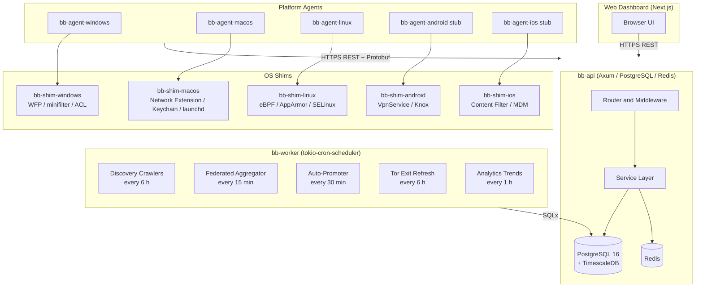
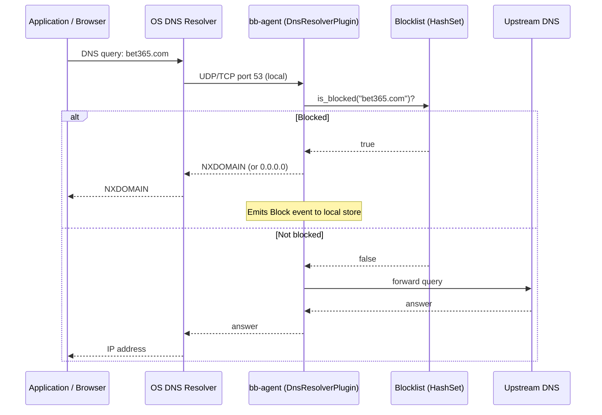
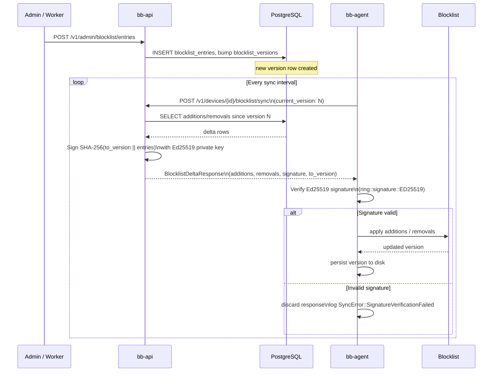
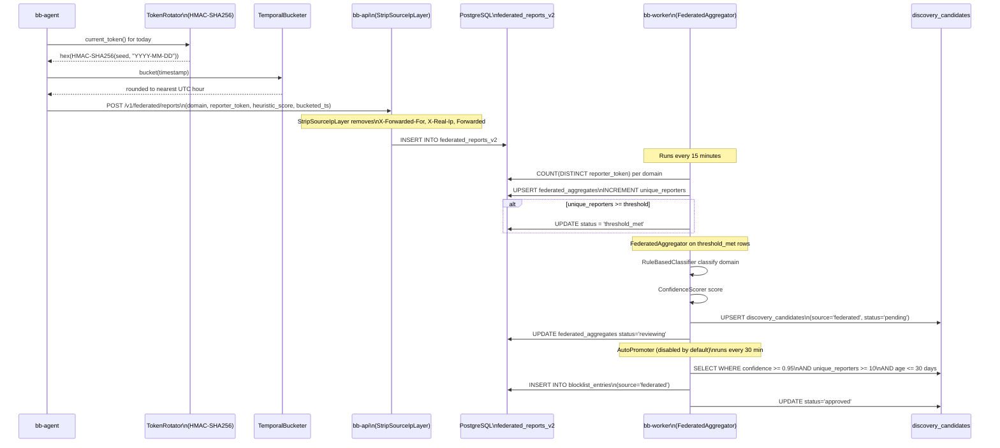

## Table of Contents

1. [Executive Summary](#1-executive-summary)
2. [System Overview](#2-system-overview)
3. [Crate Map](#3-crate-map)
4. [Data Flow](#4-data-flow)
   - 4.1 [DNS Query Blocking](#41-dns-query-blocking)
   - 4.2 [Blocklist Update Propagation](#42-blocklist-update-propagation)
   - 4.3 [Federated Report Flow](#43-federated-report-flow)
5. [Database Schema](#5-database-schema)
6. [Security Model](#6-security-model)
7. [Plugin Architecture](#7-plugin-architecture)
8. [Background Worker Jobs](#8-background-worker-jobs)
9. [Dashboard (Next.js)](#9-dashboard-nextjs)
10. [Deployment Topology](#10-deployment-topology)

---

## 1. Executive Summary

BetBlocker is an open-source, cross-platform gambling-blocking platform. Its purpose is to prevent access to online gambling sites and applications across Windows, macOS, Linux, Android, and iOS. The system is built on three pillars:

- **Centralized coordination** — a Rust/Axum REST API that manages accounts, devices, enrollments, and the canonical blocklist.
- **Distributed enforcement** — platform-native agent binaries that run on each protected device, perform DNS blocking, detect bypass attempts, and report events.
- **Federated intelligence** — an anonymous crowd-sourced reporting pipeline that surfaces new gambling domains for human review.

The project is licensed under AGPL-3.0-or-later, built with Rust 2024 edition throughout the backend, and uses Next.js 15 for the web dashboard. The workspace is a single Cargo workspace containing fifteen crates.

---

## 2. System Overview



The Android and iOS agents are in stub state: the shim crates exist and define traits, but JNI/Swift FFI implementations are pending.

### Key Architectural Decisions

**Single binary per platform.** Each platform compiles one agent binary (`bb-agent-{windows,macos,linux}`) that links `bb-agent-core` (cross-platform orchestration) and `bb-agent-plugins` (plugin runtime). Platform-specific OS integration lives in the corresponding `bb-shim-*` crate and is kept separate from blocking logic.

**Plugin trait system instead of dynamic loading.** Plugins are selected at compile time via Cargo feature flags (`dns-resolver`, `dns-hosts`, `app-process`), compiled in as enum variants, and dispatched via a macro-generated match arm. This eliminates the complexity and safety risks of `dlopen`-based plugin loading while retaining the abstraction boundary.

**Protobuf for agent-to-API communication.** The `bb-proto` crate compiles `.proto` files with `prost` at build time. This gives strongly-typed, compact binary messages for the high-frequency heartbeat and blocklist sync paths. REST+JSON is used for everything else.

**TimescaleDB for time-series event data.** The `events` table is a PostgreSQL partitioned table (monthly ranges). Continuous aggregate materialized views (`hourly_block_stats`, `daily_block_stats`) are maintained by TimescaleDB, keeping analytical queries fast without a separate time-series database.

**Federated reporting is privacy-first by design.** IP-identifying headers are stripped at the HTTP layer before federated ingestion logic ever runs. Reporter identity is replaced by a daily-rotating HMAC-SHA256 pseudonym token, and timestamps are bucketed to the nearest hour.

---

## 3. Crate Map

The workspace is defined in `Cargo.toml`. All crates share `edition = "2024"` and the workspace-level `[workspace.dependencies]` for consistent versions.

### 3.1 `bb-common`

**Path:** `crates/bb-common`

The shared vocabulary of the entire system. Every other crate that needs common types depends on this one.

- `src/enums.rs` — All domain enumerations: `AccountRole`, `Platform`, `DeviceStatus`, `EnrollmentTier`, `EnrollmentStatus`, `BlocklistSource`, `BlocklistEntryStatus`, `GamblingCategory`, `EventType`, `EventCategory`, `EventSeverity`, `VpnDetectionMode`, `TamperResponse`, `DiscoveryCandidateStatus`, `CrawlerSource`, `FederatedAggregateStatus`, `AppSignatureStatus`, `AppSignaturePlatform`, and more. All derive `Serialize`/`Deserialize` with `serde(rename_all = "snake_case")`.
- `src/error.rs` — Shared error type.
- `src/models/` — One module per entity mirroring the database schema: `account`, `analytics`, `app_signature`, `blocklist`, `bypass_detection`, `device`, `discovery_candidate`, `enrollment`, `enrollment_token`, `event`, `federated_report`, `org_device`, `org_member`, `organization`, `partner`, `tor_exit_nodes`.

No external runtime dependencies; intended to be lightweight.

### 3.2 `bb-proto`

**Path:** `crates/bb-proto`

Protobuf definitions compiled at build time via `prost`. The `build.rs` invokes `prost-build` and emits Rust code into `OUT_DIR`. The four proto modules are re-exported in `src/lib.rs`:

| Module | Purpose |
|--------|---------|
| `bb_proto::device` | Device registration and configuration messages |
| `bb_proto::heartbeat` | `HeartbeatRequest`, `HeartbeatResponse`, `ProtectionStatus`, `ResourceUsage`, `ServerCommand` |
| `bb_proto::blocklist` | `BlocklistDeltaRequest`, `BlocklistDeltaResponse`, `BlocklistAddition` |
| `bb_proto::events` | Batch event ingestion messages |

The heartbeat request includes `vpn_detected` and `proxy_detected` fields so the server knows about active bypass attempts without requiring a separate event report.

### 3.3 `bb-api`

**Path:** `crates/bb-api`

The central REST API. Runs as a single Tokio process listening on `0.0.0.0:3000` (configurable via `BB_PORT`).

**Framework stack:** Axum 0.8, Tower middleware, tower-http for CORS / tracing / request-id / gzip.

**State (`src/state.rs`):**

```
AppState {
    db:                PgPool           -- SQLx connection pool to PostgreSQL
    redis:             redis::Client    -- for refresh token storage and login lockout
    jwt_encoding_key:  Arc<EncodingKey> -- Ed25519 private key loaded from PEM
    jwt_decoding_key:  Arc<DecodingKey> -- Ed25519 public key loaded from PEM
    config:            Arc<ApiConfig>
}
```

**Configuration (`src/config.rs`):** All settings are environment variables prefixed `BB_` (e.g., `BB_DATABASE_URL`, `BB_JWT_PRIVATE_KEY_PATH`). The `config` crate deserializes them. Defaults: port 3000, Redis at `redis://localhost:6379`, access token TTL 3600 s, refresh token TTL 30 days.

**Route groups (`src/routes/mod.rs`):**

| Prefix | Auth required | Notes |
|--------|--------------|-------|
| `/v1/auth` | No | register, login, refresh, logout, forgot/reset password |
| `/v1/accounts` | Yes | self-service account management |
| `/v1/devices` | Yes | device registration, heartbeat, config |
| `/v1/enrollments` | Yes | create/update enrollments, unenroll workflows |
| `/v1/organizations` | Yes | org CRUD, member management, devices, enrollment tokens |
| `/v1/partners` | Yes | partner invite/accept/remove |
| `/v1/blocklist` | Mixed | `GET /version` and `GET /delta` are public; `POST /report` authenticated |
| `/v1/admin/blocklist` | Admin | create/update/delete entries, review queue |
| `/v1/admin/app-signatures` | Admin | CRUD for application blocking signatures |
| `/v1/admin/review-queue` | Admin | approve/reject/defer discovery candidates |
| `/v1/analytics` | Yes | timeseries, trends, summary, heatmap, CSV/PDF export |
| `/v1/enroll/{token}` | Yes | redeem a QR-code enrollment token |
| `/v1/events` | Yes | batch ingest and query events |
| `/v1/federated` | No (IP stripped) | anonymous domain reports; `StripSourceIpLayer` applied |
| `/v1/tor-exits` | No | public list of current Tor exit node IPs |
| `/v1/billing` | Yes | Stripe integration (conditional on `billing_enabled`) |
| `/health` | No | liveness check |

**Middleware stack (applied in order):**
1. CORS (`CorsLayer`)
2. Request tracing (`TraceLayer`)
3. Request ID generation (`SetRequestIdLayer` using UUIDv7)
4. Request ID propagation to response headers (`PropagateRequestIdLayer`)
5. `StripSourceIpLayer` — applied only to the `/v1/federated` sub-router

**Services (`src/services/`):** One service module per domain area. Services hold the database query logic (SQLx) and call `auth_service` functions for JWT/password operations. This keeps handlers thin.

### 3.4 `bb-worker`

**Path:** `crates/bb-worker`

A standalone Tokio binary that runs scheduled background jobs. It connects to the same PostgreSQL database as `bb-api` but does not expose any HTTP port.

**Scheduler (`src/scheduler.rs`):** A thin wrapper around `tokio_cron_scheduler::JobScheduler`. Jobs are registered with a six-field cron expression and receive an `Arc<AppContext>` containing the database pool and a `reqwest::Client`.

**Registered jobs:**

| Job name | Schedule | Description |
|----------|----------|-------------|
| `trend_computation` | `0 0 * * * *` (hourly) | Computes rolling analytics trend data into `analytics_trends` |
| `discovery_pipeline` | `0 0 */6 * * *` (every 6 h) | Runs all domain crawlers, classifies results, stores candidates |
| `federated_aggregator` | every 15 min | Processes `threshold_met` aggregates into `discovery_candidates` |
| `federated_auto_promoter` | every 30 min | Promotes high-confidence candidates to `blocklist_entries` (disabled by default) |
| `tor_exit_refresh` | `0 0 */6 * * *` (every 6 h) | Fetches Tor bulk exit list from `check.torproject.org` and replaces `tor_exit_nodes` |

### 3.5 `bb-agent-core`

**Path:** `crates/bb-agent-core`

The cross-platform blocking engine. Platform-specific binaries link this crate and add OS-specific glue on top. It re-exports `bb-agent-plugins` for convenience.

**Sub-modules:**

- `comms/` — HTTP(S) client (`client.rs`), device registration (`registration.rs`), heartbeat loop (`heartbeat.rs`), blocklist delta sync (`sync.rs`), and event batching (`reporter.rs`). The `BlocklistSyncer` verifies Ed25519 signatures on every delta response using `ring::signature::ED25519`.
- `config/` — Configuration loading from disk and environment.
- `events/` — In-process event emitter (`emitter.rs`), privacy filter (`privacy.rs`), and local store with flush-to-API (`store.rs`).
- `federated/` — Anonymization primitives: `TokenRotator` (HMAC-SHA256 daily-rotating pseudonym) and `TemporalBucketer` (rounds timestamps to the nearest UTC hour).
- `tamper/` — Binary integrity checker (`integrity.rs`) that SHA-256 hashes the agent binary on startup and re-checks every 30 minutes. Config stored at rest in AES-256-GCM encrypted files, key derived via HKDF from the machine ID. Watchdog (`watchdog.rs`) restarts or alerts on detected tampering.
- `bypass_detection/` — Orchestrates VPN, proxy, and Tor detection. Linux-specific implementations use netlink for interface monitoring. Results propagate to the next heartbeat via `vpn_detected` / `proxy_detected` fields.

**Heartbeat tiers (from `comms/heartbeat.rs`):**

| Tier | Default interval | Minimum | Maximum |
|------|----------------|---------|---------|
| Self-enrolled | 15 min | 5 min | 60 min |
| Partner | 5 min | 1 min | 15 min |
| Authority | 5 min | 1 min | 15 min |

The server can adjust the interval via an `update_interval` command in the heartbeat response, but it is clamped to the tier's bounds. Up to 1,000 heartbeats are queued offline and drained in order when connectivity returns.

### 3.6 `bb-agent-plugins`

**Path:** `crates/bb-agent-plugins`

The plugin trait system and built-in blocking implementations.

**Plugin traits (`src/traits.rs`):**

- `BlockingPlugin` — base lifecycle trait: `init`, `activate`, `deactivate`, `update_blocklist`, `health_check`.
- `DnsBlockingPlugin: BlockingPlugin` — adds `check_domain(domain: &str) -> BlockDecision` and `handle_dns_query(query: &[u8]) -> Option<Vec<u8>>`.
- `AppBlockingPlugin: BlockingPlugin` — adds `check_app`, `scan_installed`, `watch_installs` (enabled via `app-process` feature).
- `ContentBlockingPlugin: BlockingPlugin` — for future browser extension integration (Phase 3).

**Plugin registry (`src/registry.rs`):** `PluginRegistry` holds a `Vec<PluginInstance>`. `PluginInstance` is a Cargo-feature-gated enum dispatched by macro:

```
PluginInstance {
    DnsResolver(DnsResolverPlugin),  // feature: dns-resolver
    DnsHosts(HostsFilePlugin),        // feature: dns-hosts
    AppProcess(AppProcessPlugin),     // feature: app-process
}
```

`check_domain` short-circuits on the first `Block` decision for minimal latency. Failed plugin initialization removes the plugin from the registry rather than crashing the agent.

**Blocklist engine (`src/blocklist/mod.rs`):** `Blocklist` holds exact domains in a `HashSet<String>` (O(1) lookup) and wildcard patterns as suffix strings in a `Vec<String>`. The `is_blocked` check walks parent domains so that `www.bet365.com` is blocked when only `bet365.com` is in the list. The same `Blocklist` also holds an `AppSignatureStore` for application-level matching.

**DNS resolver plugin (`src/dns_resolver/`):** Wraps `hickory-server` and `hickory-resolver`. The `BlockingDnsHandler` intercepts every DNS query, checks `Blocklist::is_blocked`, and either returns `NXDOMAIN` or `0.0.0.0` for blocked domains, or forwards to the configured upstream resolvers.

**Hosts file plugin (`src/hosts_file/`):** Writes blocked domains to the OS hosts file as `0.0.0.0 <domain>` entries. A simpler fallback for environments where running a local DNS server is not possible.

**App process plugin (`src/app_process/`):** Scans running processes, watches for new installations, quarantines or terminates blocked applications.

### 3.7 `bb-agent-{windows,macos,linux}`

**Paths:** `crates/bb-agent-windows`, `crates/bb-agent-macos`, `crates/bb-agent-linux`

One binary crate per desktop platform. Each `main.rs` initializes the agent by:

1. Reading the machine ID from the platform-specific source.
2. Ensuring data directories exist (with restrictive ACLs on Windows at `C:\ProgramData\BetBlocker\`).
3. Loading configuration and enrollment.
4. Building the `PluginRegistry` with features appropriate for the platform.
5. Starting the heartbeat loop, blocklist syncer, event reporter, tamper watchdog, and bypass detector as concurrent Tokio tasks.
6. Running until a shutdown signal (`SIGTERM` / `Ctrl-C`) is received.

The `platform.rs` module in each binary provides three thin functions used by `main.rs`: `read_machine_id`, `ensure_directories`, and `service_notify_ready` / `service_notify_stopping`.

On **Windows**, `read_machine_id` reads `HKLM\SOFTWARE\Microsoft\Cryptography\MachineGuid` via `reg.exe`. On **macOS**, the agent links `bb-shim-macos` for Keychain, launchd, and Network Extension access. On **Linux**, `bb-agent-linux/src/nftables.rs` manages nftables rules for DNS interception and the agent links `bb-shim-linux` for AppArmor/SELinux/eBPF support.

### 3.8 `bb-shim-{windows,macos,linux,android,ios}`

OS-level integration crates. These do not contain business logic; they wrap platform APIs and expose Rust-idiomatic interfaces.

| Shim | Key modules |
|------|------------|
| `bb-shim-windows` | `acl` (DACL/SACL management), `dns_monitor`, `installer`, `keystore`, `service` (SCM integration), `updater`, `minifilter` (kernel filter driver, feature-gated), `wfp` (Windows Filtering Platform, feature-gated) |
| `bb-shim-macos` | `dns_monitor`, `file_protect`, `installer`, `keychain` (SecKeychain), `launchd` (plist / launchctl), `network_ext` (NetworkExtension framework), `platform`, `xpc` |
| `bb-shim-linux` | `apparmor`, `mac` (generic MAC abstraction), `selinux`, `ebpf` (feature-gated) |
| `bb-shim-android` | `device_owner` (Device Owner API), `knox` (Samsung Knox), `traits`, `vpn_service` (Android VpnService) — all currently stub implementations |
| `bb-shim-ios` | `content_filter` (NEFilterDataProvider), `mdm` (MDM profile management), `traits` — all currently stub implementations |

The Android and iOS shims define traits and stub structs. The `AndroidPlatform` and `IosPlatform` composite types bundle all managers. Real JNI (Android) and Swift FFI (iOS) implementations are future work.

### 3.9 `bb-cli`

**Path:** `crates/bb-cli`

An administrative command-line tool for operators. Used for tasks like generating enrollment tokens, inspecting blocklist state, and triggering manual syncs. Implementation is minimal at this stage.

---

## 4. Data Flow

### 4.1 DNS Query Blocking

This is the primary protection mechanism. The sequence below shows what happens when a user's browser tries to resolve a gambling domain.



**Lookup algorithm in `Blocklist::is_blocked`:**

1. Lowercase and strip trailing dot.
2. `HashSet::contains` on the full domain — O(1).
3. Walk parent domains left-to-right: `sub.bet365.com` checks `bet365.com`, then checks `com`. Any hit returns `Block`.
4. Scan `wildcard_suffixes` (a `Vec<String>`) for suffix match.
5. Return `Allow` if nothing matches.

The `BlockingDnsHandler` (from `hickory-server`) is stateless beyond the `Arc<Blocklist>`. Blocklist updates are applied atomically when the syncer delivers a new version.

### 4.2 Blocklist Update Propagation



If the server returns `full_sync_required: true` (version gap too large or data corruption), the agent falls back to requesting version 0, which returns the complete current blocklist.

The signed message covers `SHA-256(to_version_le_bytes || domain_bytes || category_bytes || confidence_le_bytes for each addition || removal_bytes for each removal)`. This prevents a man-in-the-middle from inserting or removing entries from a delta.

### 4.3 Federated Report Flow

Federated reporting allows agents to anonymously flag domains they have seen users attempting to reach, feeding the discovery pipeline.



The daily-rotating `reporter_token` means reports from the same device cannot be linked across UTC date boundaries. A fixed seed (stored in the agent's local config) ensures the token is stable within a day, allowing the aggregator to count unique reporters accurately. The `TemporalBucketer` ensures timestamps are never more precise than one hour.

---

## 5. Database Schema

PostgreSQL 16 with the TimescaleDB extension. Migrations are numbered `0001`–`0035` and applied with Flyway (not `sqlx migrate`, which expects a different naming convention).

### Core Identity Tables

**`accounts`** (`migrations/0002_create_accounts.sql`)

| Column | Type | Notes |
|--------|------|-------|
| `id` | `BIGSERIAL` | Internal surrogate key |
| `public_id` | `UUID` | External identifier (gen_random_uuid) |
| `email` | `VARCHAR(255)` | Unique |
| `password_hash` | `VARCHAR(255)` | bcrypt cost 12 |
| `role` | `account_role` | `user`, `partner`, `authority`, `admin` |
| `email_verified` | `BOOLEAN` | |
| `display_name` | `VARCHAR(100)` | |
| `mfa_enabled` | `BOOLEAN` | |
| `organization_id` | `BIGINT` | Optional org membership |
| `locked_until` | `TIMESTAMPTZ` | Brute-force lockout timestamp |
| `failed_login_attempts` | `INTEGER` | |

**`devices`** (`migrations/0007_create_devices.sql`)

| Column | Type | Notes |
|--------|------|-------|
| `id` | `BIGSERIAL` | |
| `public_id` | `UUID` | |
| `account_id` | `BIGINT -> accounts.id` | |
| `name` | `VARCHAR(100)` | |
| `platform` | `device_platform` | `windows`, `macos`, `linux`, `android`, `ios` |
| `os_version` | `VARCHAR(50)` | |
| `agent_version` | `VARCHAR(50)` | |
| `hostname` | `VARCHAR(255)` | |
| `hardware_id` | `VARCHAR(255)` | Platform machine GUID |
| `blocklist_version` | `BIGINT` | Last confirmed version on device |
| `last_heartbeat_at` | `TIMESTAMPTZ` | |
| `status` | `device_status` | `pending`, `active`, `offline`, `unenrolling`, `unenrolled` |

Partial index `idx_devices_heartbeat_active` covers only `status = 'active'` rows for efficient liveness queries.

**`enrollments`** (`migrations/0009_create_enrollments.sql`)

| Column | Type | Notes |
|--------|------|-------|
| `id` | `BIGSERIAL` | |
| `device_id` | `BIGINT -> devices.id` | |
| `account_id` | `BIGINT -> accounts.id` | |
| `enrolled_by` | `BIGINT -> accounts.id` | The partner/authority who enrolled this device |
| `tier` | `enrollment_tier` | `self`, `partner`, `authority` |
| `protection_config` | `JSONB` | VPN detection mode, tamper response, etc. |
| `reporting_config` | `JSONB` | Reporting level, org settings |
| `unenrollment_policy` | `JSONB` | `time_delayed`, `partner_approval`, `authority_approval` |
| `status` | `enrollment_status` | Multi-step state machine |
| `expires_at` | `TIMESTAMPTZ` | Optional expiry |

A partial unique index `uq_enrollments_device_active` enforces at most one active enrollment per device.

**`organizations`** — Multi-device groups (families, therapy practices, court programs, employers). Related tables: `organization_members`, `organization_devices`, `enrollment_tokens`.

### Blocklist Tables

**`blocklist_entries`** (`migrations/0011_create_blocklist_entries.sql`)

| Column | Type | Notes |
|--------|------|-------|
| `domain` | `VARCHAR(500)` | Unique; GIN trigram index for fuzzy search |
| `pattern` | `VARCHAR(500)` | Optional wildcard pattern |
| `category` | `VARCHAR(100)` | `GamblingCategory` enum value |
| `source` | `blocklist_source` | `curated`, `automated`, `federated`, `community` |
| `confidence` | `DOUBLE PRECISION` | 0.0–100.0 |
| `status` | `blocklist_entry_status` | `pending_review`, `active`, `inactive`, `rejected` |
| `blocklist_version_added` | `BIGINT` | First version containing this entry |
| `blocklist_version_removed` | `BIGINT` | First version after removal |

The `blocklist_versions` and `blocklist_version_entries` junction tables (`0012`, `0013`) enable delta sync: the API queries additions and removals between any two version numbers.

### Event and Analytics Tables

**`events`** (`migrations/0015_create_events.sql`)

Range-partitioned by `created_at` with monthly partitions (2026 partitions pre-created). Indexed on `(device_id, created_at DESC)`, `(enrollment_id, created_at DESC)`, and `(event_type, created_at DESC)`. A partial index covers only alert-severity event types (`bypass_attempt`, `tamper`, `vpn_detected`, `extension_removed`) for fast partner dashboard queries.

**TimescaleDB continuous aggregates** (`migrations/0031`, `0032`, `0033`):

- `hourly_block_stats` — `COUNT(*) GROUP BY time_bucket('1 hour'), device_id, event_type`. Refreshed every hour with a 3-hour lag.
- `daily_block_stats` — same at day granularity.
- `analytics_trends` — written by the `trend_computation` worker job.

### Federated and Discovery Tables

**`discovery_candidates`** — Domains found by crawlers or federated reports, awaiting human review. Unique on `(domain, source)`. Columns: `domain`, `source` (crawler_source enum), `source_metadata JSONB`, `confidence_score`, `classification JSONB`, `status` (pending/approved/rejected/deferred), `reviewed_by`, `reviewed_at`.

**`federated_reports_v2`** — Individual anonymous reports: `domain`, `reporter_token`, `heuristic_score`, `batch_id`. No IP address is ever stored here.

**`federated_aggregates`** — Per-domain roll-up: `unique_reporters`, `avg_heuristic_score`, `status` (`collecting` → `threshold_met` → `reviewing` → `promoted` / `rejected`), `discovery_candidate_id` (FK set once the domain is promoted). Unique on `domain`.

**`tor_exit_nodes`** — IP addresses (`inet` type) fetched from `check.torproject.org/torbulkexitlist`. Primary key on `ip_address`. Replaced atomically every 6 hours inside a transaction (DELETE all, then INSERT batch).

**`app_signatures`** (`migrations/0028`) — Named gambling application signatures: `package_names`, `executable_names`, `cert_hashes`, `display_name_patterns`, platform list, `category`, `confidence`.

### Row-Level Security

Migration `0019_create_rls_policies.sql` enables PostgreSQL RLS. Policies restrict users to rows associated with their account. Admin accounts bypass all RLS policies.

### Audit Log

Migrations `0018` and `0020` create an `audit_log` table and `AFTER UPDATE/DELETE` triggers on sensitive tables (accounts, enrollments, blocklist_entries). Every mutation records `operation`, `old_data JSONB`, `new_data JSONB`, `changed_by`, and `changed_at`.

---

## 6. Security Model

### 6.1 JWT Authentication (Ed25519)

Access tokens are signed with EdDSA (Ed25519) using the `jsonwebtoken` crate. Key material is loaded from PEM files at startup:

```
BB_JWT_PRIVATE_KEY_PATH=/etc/betblocker/keys/ed25519_private.pem
BB_JWT_PUBLIC_KEY_PATH=/etc/betblocker/keys/ed25519_public.pem
```

JWT claims structure (`src/services/auth_service.rs`):

| Field | Type | Description |
|-------|------|-------------|
| `sub` | `Uuid` | account `public_id` |
| `email` | `String` | account email |
| `role` | `String` | `user`, `partner`, `authority`, or `admin` |
| `iss` | `String` | fixed: `"betblocker-api"` |
| `iat` | `i64` | issued-at UNIX timestamp |
| `exp` | `i64` | expiry UNIX timestamp |
| `jti` | `Uuid` | UUIDv7, unique per token |

The `AuthenticatedAccount` extractor (`src/extractors.rs`) validates issuer and expiry on every authenticated request. Access tokens are not blacklisted — they expire after the TTL. Refresh tokens are stored as SHA-256 hashes in PostgreSQL (`refresh_tokens` table) and Redis, enabling immediate revocation.

Brute-force protection: five consecutive failures within 15 minutes triggers a Redis-backed 15-minute lockout keyed on email address.

Password requirements enforced at registration and reset: minimum 12 characters, at least one uppercase letter, one lowercase letter, one digit, and one special character. Stored as bcrypt at cost factor 12.

### 6.2 Role-Based Access Control

Three Axum extractors enforce role checks before handler logic runs:

- `AuthenticatedAccount` — any valid JWT.
- `RequireAdmin` — role must equal `"admin"`.
- `RequirePartnerOrAbove` — role must be `"partner"`, `"authority"`, or `"admin"`.

Enrollment tier (`self`, `partner`, `authority`) is separate from account role and governs what protection configuration the enrolled device can receive and who can approve unenrollment.

### 6.3 Enrollment-Based Access Control

An enrollment record ties a device to a protecting party and carries:

- `protection_config` — specifies `VpnDetectionMode` (disabled / log / alert / block / lockdown) and `TamperResponse` (log / alert_partner / alert_authority).
- `unenrollment_policy` — one of `time_delayed`, `partner_approval`, or `authority_approval`. This prevents a user from simply uninstalling the agent without going through the appropriate approval process.

The status machine for enrollments progresses: `pending` → `active` → `unenroll_requested` → `unenroll_approved` → `unenrolling` → `unenrolled`. The API enforces these transitions.

Enrollment tokens allow an organization to generate QR codes. When a device redeems a token via `POST /v1/enroll/{token_public_id}`, it is automatically enrolled into the organization's configuration. Tokens support expiry dates and revocation.

### 6.4 IP Stripping for Federated Reports

The `StripSourceIpLayer` Tower middleware is applied exclusively to the `/v1/federated` router:

```rust
// crates/bb-api/src/middleware/ip_strip.rs
headers.remove("x-forwarded-for");
headers.remove("x-real-ip");
headers.remove("forwarded");
```

This runs before any handler code executes. Combined with the `reporter_token` (HMAC-SHA256 pseudonym rotating daily) and hourly timestamp bucketing, no information that could identify a reporter's IP address or precise location in time ever reaches the ingestion logic or the database.

### 6.5 Blocklist Integrity (Agent Side)

All blocklist delta responses are verified with Ed25519 before being applied to the in-memory blocklist. The signed message is:

```
SHA-256(
    to_version as little-endian u64
    || for each addition: domain_bytes || category_bytes || confidence_f32_le_bytes
    || for each removal: removal_domain_bytes
)
```

This is implemented in `crates/bb-agent-core/src/comms/sync.rs` using the `ring` crate. A response with an empty or invalid signature is discarded with `SyncError::SignatureVerificationFailed` and the local blocklist is not updated.

### 6.6 Tamper Detection

`BinaryIntegrity` (in `crates/bb-agent-core/src/tamper/integrity.rs`) computes a SHA-256 hash of the agent binary at startup and re-checks every 30 minutes via a periodic Tokio task. A mismatch invokes a configurable callback that emits a `TamperDetected` event and — depending on enrollment policy — alerts the partner or authority.

Enrollment configuration is stored at rest in an AES-256-GCM encrypted file (`config.enc`). The encryption key is derived via HKDF-SHA256 from the machine ID and a random salt stored alongside the ciphertext. File format: `salt (32 bytes) || nonce (12 bytes) || ciphertext`. A backup copy (`config.enc.bak`) is kept; if the primary file fails to decrypt, the backup is tried automatically and the primary is restored from it.

---

## 7. Plugin Architecture

### 7.1 Trait Hierarchy

```
BlockingPlugin (base lifecycle)
├── DnsBlockingPlugin
│   ├── DnsResolverPlugin   (hickory-server local DNS proxy)
│   └── HostsFilePlugin     (writes /etc/hosts or equivalent)
├── AppBlockingPlugin
│   └── AppProcessPlugin    (process scanner and install watcher)
└── ContentBlockingPlugin   (reserved, Phase 3)
    └── (browser extension integration)
```

All traits require `Send + Sync + 'static` so plugins can be held in shared state across Tokio tasks.

### 7.2 Plugin Lifecycle

```
PluginRegistry::init_all(config, blocklist)
    for each plugin:
        plugin.init(config)        -- acquire OS resources, open sockets
        plugin.activate(blocklist) -- start blocking
        on failure: remove plugin from registry, continue

main loop:
    on blocklist sync complete:
        registry.update_blocklist_all(new_blocklist)

    on health check timer:
        registry.health_check_all()
        on failure: log, emit watchdog event

    on shutdown signal:
        registry.deactivate_all()
```

### 7.3 Feature Flag Compilation

Plugins are conditionally compiled using Cargo feature flags in `bb-agent-plugins/Cargo.toml`. Platform binary crates enable the features appropriate to their OS.

| Feature | Plugin compiled in |
|---------|--------------------|
| `dns-resolver` | `DnsResolverPlugin` (hickory-server) |
| `dns-hosts` | `HostsFilePlugin` |
| `app-process` | `AppProcessPlugin` |

### 7.4 Domain Check Path

When the DNS handler receives a query, the check path is:

```
BlockingDnsHandler::handle_request
  -> Blocklist::is_blocked(domain)
       1. HashSet::contains(domain)      -- exact, O(1)
       2. walk parent labels             -- subdomain coverage
       3. Vec<String> suffix scan        -- wildcard patterns
  -> if blocked: return NXDOMAIN or 0.0.0.0
  -> if allowed: forward to upstream resolver (hickory-resolver)
```

The blocklist is held behind an `Arc` so the DNS handler can continue serving queries while the syncer builds a new `Blocklist` and swaps it in without locking.

### 7.5 Platform Shim Integration

Each platform binary calls into the corresponding `bb-shim-*` crate for OS-level operations. The shims are not referenced by `bb-agent-core` or `bb-agent-plugins` — they are linked only by the platform binary. This keeps the shared crates free of OS-specific dependencies.

On Windows, DNS interception routes OS DNS through the local `DnsResolverPlugin` listener. The Windows Filtering Platform modules in `bb-shim-windows/src/wfp.rs` (feature-gated under `kernel-drivers`) can provide deeper interception that survives DNS-over-HTTPS bypass attempts.

On macOS, the Network Extension framework (`bb-shim-macos/src/network_ext.rs`) allows packet-level interception without a kernel driver. The `launchd.rs` module manages the agent's LaunchDaemon plist for persistence after reboot.

On Linux, `bb-agent-linux/src/nftables.rs` manages nftables rules for DNS redirection. The optional eBPF module in `bb-shim-linux/src/ebpf.rs` enables kernel-level packet filtering for environments where nftables rules can be bypassed.

---

## 8. Background Worker Jobs

All jobs share an `Arc<AppContext>` containing the database pool and a `reqwest::Client`.

### 8.1 Discovery Pipeline

The discovery pipeline identifies new gambling domains proactively.

**Crawlers** implement the `DomainCrawler` trait (`src/discovery/crawler.rs`):

- `AffiliateCrawler` — follows affiliate tracking links from known gambling sites.
- `LicenseRegistryCrawler` — scrapes gambling licensing authority registries.
- `WhoisPatternCrawler` — WHOIS lookups for domains matching patterns common to gambling operators.
- `DnsZoneCrawler` — DNS zone enumeration.
- `SearchCrawler` — search engine queries for gambling-related terms.

Each crawler runs through a `RateLimiter` (token bucket from the `governor` crate, default 2 req/s sustained with burst 5) to avoid hammering external services.

Results are upserted into `discovery_candidates` with `ON CONFLICT (domain, source) DO NOTHING`. The `DiscoveryPipeline::run_cycle` runs every 6 hours.

**Classifier** (`src/discovery/classifier.rs`) applies rule-based keyword and structural analysis to produce a `Classification` with `keyword_score`, `structure_score`, `link_graph_score`, and `category_guess`.

**Scorer** (`src/discovery/scorer.rs`) combines classification scores into a single `confidence: f64` in [0.0, 1.0].

### 8.2 Federated Aggregation

**FederatedAggregator** (`src/federated/aggregator.rs`): Every 15 minutes, selects all `federated_aggregates` rows with `status = 'threshold_met'`. For each domain it classifies, scores, upserts into `discovery_candidates`, and advances the aggregate status to `reviewing`.

**AutoPromoter** (`src/federated/promoter.rs`): Every 30 minutes, selects `discovery_candidates` with source `federated`, status `pending`, `confidence_score >= 0.95`, `unique_reporters >= 10`, and `first_reported_at >= NOW() - 30 days`. Qualifying domains are inserted into `blocklist_entries` with source `federated` in a single CTE. The promoter is **disabled by default** (`PromoterConfig::enabled = false`) and must be explicitly enabled by operators.

### 8.3 Tor Exit Refresh

`TorExitNodeRefreshJob` fetches `https://check.torproject.org/torbulkexitlist` every 6 hours with a 30-second HTTP timeout. The response is a newline-delimited list of IP addresses (IPv4 and IPv6). Comments and blank lines are skipped. All rows in `tor_exit_nodes` are deleted and replaced inside a single transaction, keeping the table always consistent.

The table is exposed via `GET /v1/tor-exits` (public, no auth). Agents use this to check whether a detected VPN exit is a known Tor exit node.

### 8.4 Analytics Trend Computation

`trends::compute_trends` runs at the top of every hour. It reads recent event counts from `hourly_block_stats` (the TimescaleDB continuous aggregate) and writes summary rows to `analytics_trends`. This pre-computation keeps dashboard analytics queries sub-second even at scale.

---

## 9. Dashboard (Next.js)

**Path:** `web/`

A Next.js 15 application using the App Router with two route groups:

- `(auth)/` — login, register, forgot-password, reset-password. Unauthenticated.
- `(dashboard)/` — all protected pages. Requires a valid session cookie.

### Route Structure

| Route | Description |
|-------|-------------|
| `/dashboard` | Overview with key metrics |
| `/devices` | Device list; `/devices/add` wizard; `/devices/[id]` detail |
| `/enrollments/[id]` | Enrollment detail and unenroll flow |
| `/organizations` | Org management, members, tokens, device assignment |
| `/partners` | Partner invite/accept/remove |
| `/reports/analytics` | Timeseries, heatmap, trend cards |
| `/admin/blocklist` | CRUD and review queue |
| `/admin/app-signatures` | Application signature management |
| `/admin/review-queue` | Discovery candidate review |
| `/partner-dashboard` | Partner view of managed devices and unenroll approvals |

### API Communication

The dashboard calls `bb-api` over HTTPS. Session tokens are stored as HTTP-only cookies. Next.js API routes at `web/src/app/api/auth/` handle token refresh and logout, proxying to `bb-api` while keeping the raw JWT out of JavaScript-accessible storage.

### Analytics Components

- `TimeseriesChart` — block count over time.
- `ActivityHeatmap` — hour-of-day by day-of-week heat map.
- `TrendCards` — percentage changes versus previous period.
- `CategoryChart` — breakdown by `GamblingCategory`.

---

## 10. Deployment Topology

```
Internet
   |
   v
+------------------------------+
| Load Balancer / Reverse Proxy|
| (nginx / Caddy / Cloudflare) |
+---------------+--------------+
                |  HTTPS
      +---------+----------+
      |                    |
      v                    v
+-----------+      +---------------+
|  bb-api   |      | Next.js       |
|  :3000    |      | Dashboard     |
+-----+-----+      +---------------+
      |
  +---+----------------------------+
  |                                |
  v                                v
+----------------+         +----------+
| PostgreSQL 16  |         |  Redis   |
| + TimescaleDB  |         |          |
+----------------+         +----------+
      ^
      |
+-----+------+
|  bb-worker |
|  (cron)    |
+------------+
```

**Configuration surface:**

| Variable | Default | Required |
|----------|---------|----------|
| `BB_DATABASE_URL` | — | Yes |
| `BB_REDIS_URL` | `redis://localhost:6379` | No |
| `BB_HOST` | `0.0.0.0` | No |
| `BB_PORT` | `3000` | No |
| `BB_JWT_PRIVATE_KEY_PATH` | — | Yes |
| `BB_JWT_PUBLIC_KEY_PATH` | — | Yes |
| `BB_JWT_ACCESS_TOKEN_TTL_SECS` | `3600` | No |
| `BB_JWT_REFRESH_TOKEN_TTL_DAYS` | `30` | No |
| `BB_BILLING_ENABLED` | `false` | No |
| `BB_STRIPE_SECRET_KEY` | — | If billing enabled |
| `BB_STRIPE_WEBHOOK_SECRET` | — | If billing enabled |
| `BB_PUBLIC_BASE_URL` | — | For QR code generation |

**Migrations** are applied with Flyway or a compatible runner that handles the `NNNN_description.sql` naming convention. The API does not auto-migrate on startup (the `main.rs` comment notes this explicitly).

**Agent distribution:** Each platform agent binary is distributed as a signed installer. The Windows installer uses `bb-shim-windows/src/installer.rs` to register the Windows Service and apply directory ACLs. The macOS installer uses `bb-shim-macos/src/installer.rs` and `launchd.rs` to install the LaunchDaemon plist.

---

## Appendix: Key File Reference

| Purpose | Path |
|---------|------|
| Workspace manifest | `Cargo.toml` |
| API entrypoint | `crates/bb-api/src/main.rs` |
| API route assembly | `crates/bb-api/src/routes/mod.rs` |
| API application state | `crates/bb-api/src/state.rs` |
| API configuration | `crates/bb-api/src/config.rs` |
| JWT auth service | `crates/bb-api/src/services/auth_service.rs` |
| Role extractors | `crates/bb-api/src/extractors.rs` |
| IP-strip middleware | `crates/bb-api/src/middleware/ip_strip.rs` |
| Worker entrypoint | `crates/bb-worker/src/main.rs` |
| Job scheduler | `crates/bb-worker/src/scheduler.rs` |
| Tor exit refresh | `crates/bb-worker/src/tor_exits.rs` |
| Federated aggregator | `crates/bb-worker/src/federated/aggregator.rs` |
| Auto-promoter | `crates/bb-worker/src/federated/promoter.rs` |
| All enumerations | `crates/bb-common/src/enums.rs` |
| Plugin trait definitions | `crates/bb-agent-plugins/src/traits.rs` |
| Plugin registry | `crates/bb-agent-plugins/src/registry.rs` |
| Blocklist engine | `crates/bb-agent-plugins/src/blocklist/mod.rs` |
| DNS blocking handler | `crates/bb-agent-plugins/src/dns_resolver/handler.rs` |
| Heartbeat loop | `crates/bb-agent-core/src/comms/heartbeat.rs` |
| Blocklist sync and signature verify | `crates/bb-agent-core/src/comms/sync.rs` |
| Binary tamper detection | `crates/bb-agent-core/src/tamper/integrity.rs` |
| Federated anonymization | `crates/bb-agent-core/src/federated/anonymizer.rs` |
| Bypass detection orchestrator | `crates/bb-agent-core/src/bypass_detection/mod.rs` |
| Windows platform bridge | `crates/bb-agent-windows/src/platform.rs` |
| Windows shim modules | `crates/bb-shim-windows/src/lib.rs` |
| macOS shim modules | `crates/bb-shim-macos/src/lib.rs` |
| Linux shim modules | `crates/bb-shim-linux/src/lib.rs` |
| Android shim (stubs) | `crates/bb-shim-android/src/lib.rs` |
| iOS shim (stubs) | `crates/bb-shim-ios/src/lib.rs` |
| Enum type migrations | `migrations/0001_create_enum_types.sql` |
| Events table | `migrations/0015_create_events.sql` |
| TimescaleDB setup | `migrations/0030_enable_timescaledb.sql` |
| Hourly aggregate | `migrations/0031_create_hourly_block_stats.sql` |
| Federated tables | `migrations/0027_create_federated_tables.sql` |
| Tor exit nodes table | `migrations/0034_create_tor_exit_nodes.sql` |
