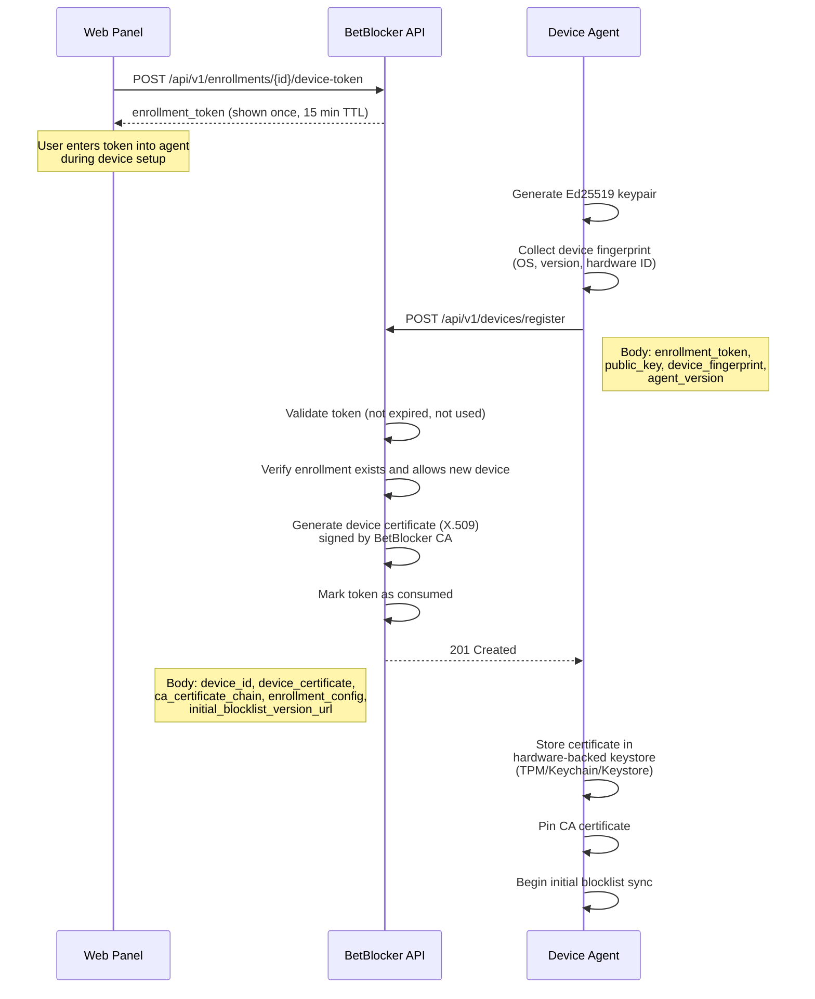
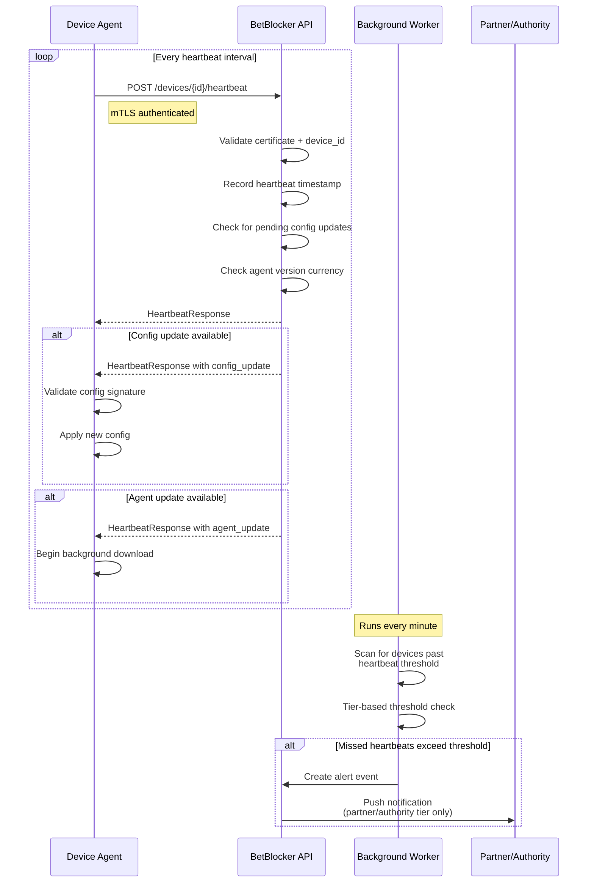
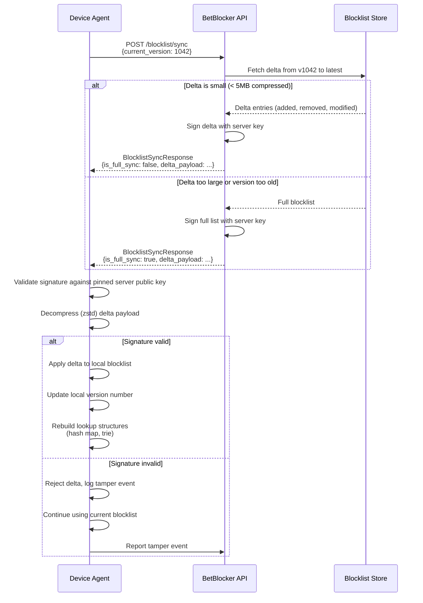
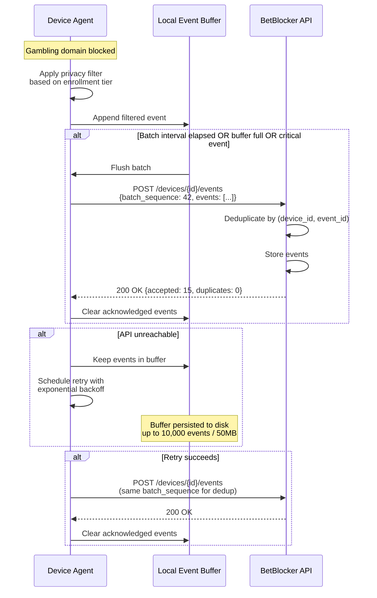

**Date:** 2026-03-12
**Status:** Draft
**Authors:** JD + Claude

---

## Overview

This document defines the communication protocol between the BetBlocker endpoint agent (Rust, running on enrolled devices) and the central BetBlocker API (Rust/Axum). The protocol governs device registration, ongoing heartbeats, blocklist synchronization, event reporting, federated intelligence, configuration management, and agent updates.

### Design Principles

1. **Offline-first** -- The agent must block gambling with zero connectivity. Every protocol interaction is designed so the agent degrades gracefully when the server is unreachable.
2. **Tamper-evident** -- Every payload from the server is cryptographically signed. The agent validates before applying.
3. **Privacy by design** -- Filtering happens at the agent before data leaves the device. The enrollment tier determines what is reported, not what is collected.
4. **Idempotent operations** -- Every request the agent sends can be safely retried without side effects.
5. **Bandwidth-conscious** -- Binary formats and delta sync minimize data transfer, critical for mobile devices on metered connections.

### Enrollment Tier Impact on Protocol Behavior

| Behavior | Self | Partner | Authority |
|----------|------|---------|-----------|
| Heartbeat interval (default) | 15 min | 5 min | 5 min |
| Heartbeat interval (minimum allowed) | 5 min | 1 min | 1 min |
| Missed heartbeat alert threshold | 3 missed | 2 missed | 1 missed |
| Event reporting detail level | Aggregated counts | Aggregated by default, detailed with consent | Full detail, audit log |
| Bypass attempt reporting | Logged locally only | Alerted to partner | Alerted to authority + audit trail |
| Federated reporting | Opt-in | Opt-in | Mandatory |

---

## 1. Device Registration and Authentication

### 1.1 Enrollment Token Generation

Registration begins on the web panel. A user (or partner, or authority) initiates device enrollment, which generates a short-lived enrollment token.

- **Token format:** 256-bit random value, base62 encoded (43 characters), prefixed with tier indicator (`S-`, `P-`, `A-`)
- **Token lifetime:** 15 minutes from generation
- **Token is single-use:** consumed on successful registration, invalidated on expiry
- **Token storage:** hashed (SHA-256) in the database; the plaintext is shown once to the user and never stored server-side

### 1.2 Initial Registration Flow



### 1.3 Registration Request

```
POST /api/v1/devices/register
Content-Type: application/protobuf

message DeviceRegistrationRequest {
  string enrollment_token = 1;
  bytes  public_key = 2;           // Ed25519 public key, 32 bytes
  DeviceFingerprint fingerprint = 3;
  string agent_version = 4;

  message DeviceFingerprint {
    string os_type = 1;            // "windows", "macos", "linux", "android", "ios"
    string os_version = 2;
    string hardware_id = 3;        // Platform-specific stable ID (TPM-based where available)
    string hostname = 4;           // User-visible device name
  }
}
```

### 1.4 Registration Response

```
message DeviceRegistrationResponse {
  string device_id = 1;               // UUID v7
  bytes  device_certificate = 2;       // X.509 certificate, PEM-encoded
  bytes  ca_certificate_chain = 3;     // Full chain for pinning
  EnrollmentConfig enrollment_config = 4;
  string initial_blocklist_url = 5;    // URL for full blocklist download
  uint64 initial_blocklist_version = 6;
  bytes  initial_blocklist_signature = 7;
  uint64 certificate_expires_at = 8;   // Unix timestamp
}
```

### 1.5 Mutual TLS with Certificate Pinning

After registration, all subsequent communication uses mTLS:

- **Agent authenticates server:** The agent pins the BetBlocker CA certificate received during registration. It rejects any TLS connection whose server certificate is not signed by this CA. This prevents MITM attacks even if a system-level CA is compromised.
- **Server authenticates agent:** The server requires the client certificate issued during registration. The server validates the certificate against its CA and checks that the device_id in the certificate subject matches the request context.
- **No bearer tokens for agent-API calls:** The mTLS handshake is the authentication. This eliminates token theft as an attack vector.

### 1.6 Certificate Rotation

Certificates have a **90-day lifetime**. The agent initiates rotation proactively:

- **At 60 days (2/3 lifetime):** Agent generates a new keypair and sends a `POST /api/v1/devices/{id}/rotate-certificate` request, signed with the current certificate.
- **Server validates:** Current certificate is valid and not revoked, device is in good standing.
- **Server issues:** New certificate with fresh 90-day lifetime.
- **Agent transition:** Agent stores new certificate, confirms it works with a test heartbeat, then deletes the old keypair.
- **Overlap window:** Both old and new certificates are valid for 48 hours after rotation, ensuring no connectivity gap.

### 1.7 Certificate Revocation and Expiry

| Scenario | Server Behavior | Agent Behavior |
|----------|----------------|----------------|
| Certificate expired (agent offline >90 days) | Reject mTLS handshake | Fall back to re-registration flow using stored enrollment metadata |
| Certificate revoked (unenrollment, compromise) | Reject mTLS, return `403` with `CERTIFICATE_REVOKED` reason | Stop reporting, continue blocking from cache (for self-tier: begin unenrollment countdown; for partner/authority: maintain blocking indefinitely) |
| CA rotation (planned) | Issue new CA cert during heartbeat response 30 days before old CA expires | Pin both old and new CA certs during transition |

### 1.8 Re-registration After Expiry

If the agent's certificate has expired (device was offline for >90 days), the agent attempts re-registration:

1. Agent sends `POST /api/v1/devices/re-register` with its `device_id`, `hardware_id`, and a signature from its (expired) keypair.
2. Server verifies the hardware fingerprint matches the known device record and the signature is valid (even though the cert is expired, the key is still trusted for re-registration).
3. Server issues a new certificate. No new enrollment token is needed -- the device enrollment still exists.
4. If the enrollment itself has been revoked during the offline period, the server returns `410 Gone` with the revocation reason.

---

## 2. Heartbeat Protocol

### 2.1 Heartbeat Request

The agent sends periodic heartbeats to signal liveness and report status.

```
POST /api/v1/devices/{device_id}/heartbeat
Content-Type: application/protobuf
X-BB-Sequence: {monotonic_counter}

message HeartbeatRequest {
  string device_id = 1;
  uint64 sequence_number = 2;         // Monotonically increasing, detects replay
  uint64 timestamp = 3;               // Agent-side Unix timestamp (ms)
  string agent_version = 4;
  string os_version = 5;
  uint64 blocklist_version = 6;
  ProtectionStatus protection_status = 7;
  bytes  integrity_hash = 8;          // SHA-256 of agent binary + config
  uint64 uptime_seconds = 9;
  ResourceUsage resource_usage = 10;
  uint32 queued_events = 11;          // Number of unsent events in local buffer
  uint32 queued_reports = 12;         // Number of unsent federated reports

  message ProtectionStatus {
    LayerStatus dns_blocking = 1;
    LayerStatus hosts_file = 2;
    LayerStatus app_blocking = 3;     // Phase 2
    LayerStatus browser_extension = 4; // Phase 3
    LayerStatus network_hook = 5;     // Platform-specific (WFP, NetworkExtension, etc.)
    bool watchdog_alive = 6;
    bool config_integrity_ok = 7;
  }

  enum LayerStatus {
    ACTIVE = 0;
    DEGRADED = 1;       // Running but with reduced capability
    INACTIVE = 2;       // Not running (expected, e.g., phase not deployed)
    FAILED = 3;         // Should be running but is not
  }

  message ResourceUsage {
    float cpu_percent = 1;            // Agent CPU usage (0.0 - 100.0)
    uint64 memory_bytes = 2;          // Agent RSS
    uint64 disk_cache_bytes = 3;      // Blocklist + event cache size on disk
  }
}
```

### 2.2 Heartbeat Response

```
message HeartbeatResponse {
  HeartbeatAck ack = 1;
  optional ConfigUpdate config_update = 2;
  optional AgentUpdateNotification agent_update = 3;
  bool force_blocklist_sync = 4;       // Server requests immediate full sync
  uint64 server_timestamp = 5;         // For clock drift detection
  uint64 next_heartbeat_seconds = 6;   // Server can adjust heartbeat interval

  enum HeartbeatAck {
    OK = 0;
    CLOCK_DRIFT_WARNING = 1;           // Agent clock differs > 5 min from server
    INTEGRITY_MISMATCH = 2;            // Server's expected hash != agent's reported hash
    VERSION_OUTDATED = 3;              // Agent version is behind minimum supported
    ENROLLMENT_SUSPENDED = 4;          // Enrollment temporarily suspended
  }
}
```

### 2.3 Heartbeat Frequency

| Tier | Default Interval | Minimum Allowed | Maximum Allowed |
|------|-----------------|-----------------|-----------------|
| Self | 15 minutes | 5 minutes | 60 minutes |
| Partner | 5 minutes | 1 minute | 15 minutes |
| Authority | 5 minutes | 1 minute | 5 minutes |

The server can dynamically adjust the interval via `next_heartbeat_seconds` in the response. The agent respects this within the min/max bounds for its tier.

### 2.4 Heartbeat Cycle



### 2.5 Missed Heartbeat Detection (Server-Side)

The background worker runs missed-heartbeat detection on a 1-minute cycle:

1. Query all devices where `last_heartbeat_at < NOW() - (heartbeat_interval * alert_threshold_multiplier)`.
2. Apply tier-specific thresholds (see table in overview).
3. For **self-tier**: Log the event. No external notification (user configured their own threshold or opted out).
4. For **partner-tier**: Send push notification to accountability partner. Escalate after 2x threshold (e.g., 2 missed at 5-min interval = alert at 10 min; escalation at 20 min).
5. For **authority-tier**: Immediate alert to authority dashboard. Flag device as "unresponsive" in compliance view. After 4x threshold, mark as "potentially non-compliant."

### 2.6 Offline Heartbeat Behavior

When the agent cannot reach the API:

1. **Continue blocking normally** from cached blocklist and config.
2. **Queue heartbeats locally** with their original timestamps.
3. **On reconnection**, send a `POST /api/v1/devices/{id}/heartbeat-batch` containing all queued heartbeats (maximum 1000 per batch; older entries dropped first if queue exceeds limit).
4. **Server processes batch**: Records all timestamps for the offline period analysis, but only the latest heartbeat determines current device status.

```
message HeartbeatBatch {
  string device_id = 1;
  repeated HeartbeatRequest heartbeats = 2;  // Ordered by sequence_number
}
```

---

## 3. Blocklist Sync Protocol

### 3.1 Version-Based Delta Sync

The agent maintains a local blocklist with a version number. On sync, it sends its current version and receives only the changes since that version.

```
POST /api/v1/blocklist/sync
Content-Type: application/protobuf

message BlocklistSyncRequest {
  string device_id = 1;
  uint64 current_version = 2;         // 0 = initial sync (full download)
  string platform = 3;                // Platform-specific entries may differ
}
```

### 3.2 Delta Response

```
message BlocklistSyncResponse {
  uint64 from_version = 1;
  uint64 to_version = 2;
  bool is_full_sync = 3;              // true if server sent complete list
  bytes delta_payload = 4;            // Compressed (zstd) delta or full list
  bytes signature = 5;                // Ed25519 signature over SHA-256(to_version || delta_payload)
  bytes signing_key_id = 6;           // Which server signing key was used
  uint64 next_sync_hint_seconds = 7;  // Suggested time until next sync check
  uint32 total_entries = 8;           // Total entries after applying delta
}
```

### 3.3 Delta Payload Format

The delta payload (after zstd decompression) is a protobuf message:

```
message BlocklistDelta {
  repeated BlocklistEntry added = 1;
  repeated string removed_domains = 2;    // Domains to remove
  repeated BlocklistEntry modified = 3;   // Changed category or confidence

  message BlocklistEntry {
    string domain = 1;                    // e.g., "example-casino.com"
    string pattern = 2;                   // Optional: regex pattern for subdomain matching
    Category category = 3;
    float confidence = 4;                 // 0.0-1.0, entries below agent threshold are soft-blocked
    EntrySource source = 5;

    enum Category {
      CASINO = 0;
      SPORTS_BETTING = 1;
      POKER = 2;
      LOTTERY = 3;
      BINGO = 4;
      FANTASY_SPORTS = 5;
      CRYPTO_GAMBLING = 6;
      AFFILIATE = 7;                      // Gambling affiliate/comparison site
      PAYMENT_PROCESSOR = 8;              // Gambling-specific payment providers
      OTHER_GAMBLING = 9;
    }

    enum EntrySource {
      CURATED = 0;         // Human-reviewed and approved
      AUTOMATED = 1;       // Classifier-approved, pending human review
      FEDERATED = 2;       // From agent reports, promoted after review
      COMMUNITY = 3;       // From community blocklist feed
    }
  }
}
```

### 3.4 Blocklist Sync Sequence



### 3.5 Full Sync Trigger Conditions

The server sends a full blocklist (instead of a delta) when any of these conditions are true:

- Agent's `current_version` is 0 (initial sync).
- Agent's version is older than the oldest retained delta (server retains deltas for the last 30 days / 500 versions, whichever is less).
- The computed delta would be larger than 80% of the full blocklist size.
- The server sets `force_blocklist_sync` in a heartbeat response (e.g., after a blocklist schema change).

### 3.6 Cryptographic Signing

- **Signing algorithm:** Ed25519 over SHA-256 hash of `(to_version as big-endian u64 || delta_payload bytes)`.
- **Key management:** The server maintains 2 signing keys -- one active, one for rotation. The agent trusts both keys (received during registration and updated during certificate rotation).
- **Key rotation:** New signing key distributed via heartbeat `config_update` at least 7 days before old key is retired. Agent accepts signatures from either key during the transition.

### 3.7 Offline Resilience

- The agent always maintains a complete local blocklist on disk, encrypted at rest with a hardware-bound key.
- The local blocklist is the source of truth for blocking decisions. The agent never requires network access to block.
- On startup, the agent loads the local blocklist before attempting any network sync.
- If the local blocklist is corrupted (hash mismatch on load), the agent requests a full sync immediately. During the sync, it blocks using the HOSTS file fallback layer (which has its own copy of high-confidence domains).

---

## 4. Event Reporting Protocol

### 4.1 Event Types and Payloads

```
message EventBatch {
  string device_id = 1;
  uint64 batch_sequence = 2;          // For deduplication
  repeated Event events = 3;

  message Event {
    string event_id = 1;              // UUID v7 (contains timestamp)
    uint64 timestamp = 2;             // Unix timestamp (ms)
    EventType type = 3;
    oneof payload {
      BlockEvent block = 4;
      BypassAttemptEvent bypass_attempt = 5;
      TamperEvent tamper = 6;
      EnrollmentChangeEvent enrollment_change = 7;
    }

    enum EventType {
      BLOCK = 0;
      BYPASS_ATTEMPT = 1;
      TAMPER = 2;
      ENROLLMENT_CHANGE = 3;
    }
  }

  message BlockEvent {
    string domain = 1;                // Blocked domain
    Category category = 2;            // From blocklist entry
    BlockingLayer layer = 3;          // Which layer caught it

    enum BlockingLayer {
      DNS = 0;
      HOSTS_FILE = 1;
      NETWORK_HOOK = 2;              // WFP, NetworkExtension, etc.
      APP_BLOCK = 3;
      BROWSER_EXTENSION = 4;
    }
  }

  message BypassAttemptEvent {
    BypassType type = 1;
    string details = 2;              // Structured detail (JSON within protobuf for flexibility)
    Severity severity = 3;

    enum BypassType {
      VPN_DETECTED = 0;
      DNS_CONFIG_CHANGE = 1;
      AGENT_KILL_ATTEMPT = 2;
      PROXY_DETECTED = 3;
      TOR_DETECTED = 4;
      DOH_DOT_BYPASS = 5;            // Attempt to use external DoH/DoT
      HOSTS_FILE_MODIFICATION = 6;
      FIREWALL_RULE_CHANGE = 7;
    }

    enum Severity {
      LOW = 0;       // Informational (e.g., VPN for non-gambling use)
      MEDIUM = 1;    // Suspicious but possibly legitimate
      HIGH = 2;      // Likely intentional bypass attempt
      CRITICAL = 3;  // Active tampering detected
    }
  }

  message TamperEvent {
    TamperType type = 1;
    string details = 2;

    enum TamperType {
      BINARY_MODIFIED = 0;
      CONFIG_TAMPERED = 1;
      WATCHDOG_RESTART = 2;
      SERVICE_STOP_ATTEMPT = 3;
      FILE_DELETION_ATTEMPT = 4;
      PRIVILEGE_ESCALATION = 5;
    }
  }

  message EnrollmentChangeEvent {
    string change_type = 1;           // "tier_change", "config_update", "unenroll_request"
    string old_value = 2;
    string new_value = 3;
    string initiated_by = 4;          // "user", "partner", "authority", "system"
  }
}
```

### 4.2 Privacy Filtering (Agent-Side)

Before any event leaves the device, the agent applies enrollment-tier-based filtering. This is a hard architectural constraint -- the API must never rely on receiving data that the agent is configured to filter.

| Event Field | Self Tier | Partner Tier | Authority Tier |
|-------------|-----------|--------------|----------------|
| `block.domain` | Hashed (SHA-256) | Hashed (default) or plaintext (with mutual consent) | Plaintext |
| `block.category` | Included | Included | Included |
| `block.layer` | Included | Included | Included |
| `bypass_attempt.details` | Redacted (type only) | Included | Included + timestamps |
| `tamper.details` | Redacted (type only) | Included | Included + full context |
| `enrollment_change.*` | Included | Included | Included + audit metadata |

For self-tier users who opt out of reporting entirely, the agent sends only heartbeats (no event batches). The agent still logs events locally for the user's own dashboard.

### 4.3 Batch Submission

```
POST /api/v1/devices/{device_id}/events
Content-Type: application/protobuf
```

- **Default batch interval:** 60 seconds
- **Maximum batch size:** 500 events
- **Flush triggers:** Interval timer fires, batch size limit reached, or a CRITICAL severity event occurs (immediate flush)
- **Deduplication:** Server uses `(device_id, event_id)` as idempotency key. Duplicate batches (same `batch_sequence`) are acknowledged without re-processing.

### 4.4 Event Reporting Sequence



### 4.5 Retry Strategy

- **Backoff schedule:** 5s, 15s, 30s, 60s, 120s, 300s, 600s (10 min cap)
- **Jitter:** +/- 20% random jitter on each interval to prevent thundering herd
- **Maximum retries:** Unlimited (events are retained until successfully sent or aged out)
- **Age-out policy:** Events older than 7 days are dropped from the buffer (they are still in the local log for the user's own viewing)

### 4.6 Local Event Log

Independent of what is sent to the API, the agent maintains a local event log:

- **Format:** Append-only SQLite database
- **Rotation:** 30 days or 100MB, whichever comes first
- **Access:** Readable by the local device dashboard (served by the agent on a localhost-only port, authenticated by enrollment credentials)
- **Privacy:** Local log always contains full detail (no tier-based filtering), since it never leaves the device

---

## 5. Federated Report Protocol

### 5.1 Purpose

Agents contribute to the collective gambling domain intelligence by reporting unknown domains that match heuristic patterns. This crowdsourced data feeds the central review queue, where automated classifiers and human reviewers promote confirmed gambling domains to the blocklist.

### 5.2 Report Payload

```
POST /api/v1/federated/reports
Content-Type: application/protobuf

message FederatedReportBatch {
  bytes anonymous_token = 1;           // Rotating anonymous ID (see 5.3)
  repeated FederatedReport reports = 2;

  message FederatedReport {
    string report_id = 1;             // UUID v7
    string domain = 2;
    HeuristicType heuristic_type = 3;
    float confidence = 4;             // 0.0-1.0
    uint64 timestamp = 5;
    HeuristicEvidence evidence = 6;

    enum HeuristicType {
      KEYWORD_MATCH = 0;              // Domain name contains gambling keywords
      TLS_CERT_PATTERN = 1;           // Certificate matches known gambling operator patterns
      REDIRECT_CHAIN = 2;            // Domain redirects to known gambling domain
      CONTENT_SIGNAL = 3;            // Page content matches gambling patterns (browser ext)
      DNS_PATTERN = 4;               // DNS infrastructure shared with known gambling domains
      APP_SIGNATURE = 5;             // App matches gambling app signatures
    }

    message HeuristicEvidence {
      string matched_pattern = 1;     // What pattern triggered (e.g., keyword, cert CN)
      repeated string redirect_chain = 2; // For REDIRECT_CHAIN: the hop sequence
      float classifier_score = 3;     // If local ML classifier ran, its score
    }
  }
}
```

### 5.3 Anonymization

Federated reports must not be linkable to a specific device or user:

- **Anonymous token:** A 256-bit token, rotated every 24 hours. Derived from `HMAC-SHA256(device_secret, "federated-report" || date)`. The server cannot reverse this to a device_id.
- **No IP correlation:** The server does not log source IP addresses for federated report submissions. (Enforced at the load balancer level by stripping `X-Forwarded-For` for this endpoint.)
- **No mTLS for this endpoint:** Federated reports use a separate HTTPS endpoint that does not require client certificates. The agent authenticates using a lightweight proof-of-enrollment (a signed challenge token refreshed weekly via the authenticated heartbeat channel) to prevent abuse from non-enrolled devices, but this token is not linkable to a specific device.
- **Batching window:** Reports are held for a random delay (1-10 minutes) before submission to prevent timing correlation.

### 5.4 Rate Limiting

- **Agent-side:** Maximum 50 reports per hour per agent. The agent tracks this locally and drops excess reports with a log entry.
- **Server-side:** Maximum 200 reports per anonymous_token per hour. Beyond this, the server returns `429 Too Many Requests`.
- **Global:** If the review queue exceeds capacity, the server can return a `Retry-After` header to throttle all reporters.

### 5.5 Server Response

```
message FederatedReportResponse {
  repeated ReportAck acks = 1;

  message ReportAck {
    string report_id = 1;
    ReportStatus status = 2;

    enum ReportStatus {
      ACCEPTED = 0;          // Queued for review
      ALREADY_KNOWN = 1;     // Domain already in blocklist
      ALREADY_REPORTED = 2;  // Domain already in review queue
      REJECTED = 3;          // Domain fails basic validation (e.g., not a valid FQDN)
    }
  }
}
```

When the agent receives `ALREADY_KNOWN` or `ALREADY_REPORTED`, it caches this for 24 hours to avoid re-reporting the same domain.

---

## 6. Configuration Push

### 6.1 Delivery Mechanisms

Configuration updates reach the agent through two channels:

1. **Heartbeat piggyback (primary):** The server includes a `ConfigUpdate` in the heartbeat response when a pending update exists. This is the default path -- it requires no additional infrastructure and works within the existing mTLS channel.
2. **Push channel (optional, for partner/authority tier):** A WebSocket connection maintained alongside the heartbeat cycle for low-latency updates. The agent opens `wss://api.betblocker.com/api/v1/devices/{device_id}/push` after registration, authenticated via the same mTLS certificate. This channel is used for time-sensitive updates (e.g., authority adding a domain to a device's custom blocklist).

### 6.2 Configuration Update Message

```
message ConfigUpdate {
  string config_id = 1;               // UUID v7, for ack tracking
  uint64 version = 2;                 // Monotonically increasing
  ConfigType type = 3;
  bytes payload = 4;                  // Type-specific protobuf, compressed
  bytes signature = 5;                // Server signature over (config_id || version || type || payload)
  uint64 effective_at = 6;            // When to apply (0 = immediately)
  bool requires_restart = 7;          // Agent should restart after applying

  enum ConfigType {
    PROTECTION_CONFIG = 0;            // Which layers active, sensitivity thresholds
    REPORTING_CONFIG = 1;             // Event types to report, detail levels, intervals
    BLOCKLIST_FORCE_SYNC = 2;         // Trigger immediate blocklist sync
    AGENT_UPDATE_AVAILABLE = 3;       // New agent version ready
    ENROLLMENT_UPDATE = 4;            // Tier change, authority change
    CUSTOM_BLOCKLIST = 5;             // Per-enrollment additional domains
    HEARTBEAT_CONFIG = 6;             // Interval change
  }
}
```

### 6.3 Config Validation and Application

1. **Signature check:** Agent validates the signature using the pinned server signing key. If invalid, the config is rejected and a tamper event is logged.
2. **Schema validation:** Agent validates the payload against expected schema for the config type. Malformed configs are rejected.
3. **Bounds checking:** Agent enforces local constraints (e.g., heartbeat interval must be within tier's min/max range). Out-of-bounds values are clamped, not rejected.
4. **Backup current config:** Before applying, agent stores current config as `config.prev` in the secure config store.
5. **Apply and verify:** Agent applies the new config and runs a health check within 30 seconds.
6. **Ack or rollback:**
   - If health check passes: Agent sends `POST /api/v1/devices/{device_id}/config-ack` with the `config_id`.
   - If health check fails: Agent reverts to `config.prev`, logs the failure, and sends a config rejection event.

### 6.4 Configuration Precedence

```
Server-pushed config > Enrollment defaults > Platform defaults > Hardcoded minimums
```

Hardcoded minimums cannot be overridden by any config push. Examples:
- DNS blocking cannot be disabled via config push (it can only be disabled by unenrollment).
- Heartbeat interval cannot exceed the tier's maximum.
- Event buffer cannot be set below 100 events.

---

## 7. Agent Update Protocol

### 7.1 Update Notification

The server signals available updates via the heartbeat response:

```
message AgentUpdateNotification {
  string version = 1;                 // Semantic version (e.g., "1.3.0")
  string download_url = 2;            // CDN URL for the platform-specific binary
  bytes  expected_hash = 3;           // SHA-256 of the binary
  bytes  signature = 4;               // Ed25519 signature over (version || expected_hash)
  string release_notes_url = 5;
  UpdateUrgency urgency = 6;
  uint64 deadline = 7;                // Unix timestamp: must update by this time (0 = no deadline)

  enum UpdateUrgency {
    ROUTINE = 0;          // Apply at next convenient window
    RECOMMENDED = 1;      // Apply within 24 hours
    SECURITY = 2;         // Apply within 1 hour
    CRITICAL = 3;         // Apply immediately, skip convenience windows
  }
}
```

### 7.2 Staged Rollout

The server controls rollout via device cohorts:

- Each device is assigned to a rollout cohort based on `hash(device_id) % 100` (stable, deterministic).
- The server maintains a rollout percentage per version (e.g., "v1.3.0: 10%").
- Only devices in cohort 0-9 receive the update notification when rollout is at 10%.
- Rollout percentage increases as health metrics from early adopters confirm stability.
- Authority-tier devices receive updates last (after 80% rollout) unless the update is `SECURITY` or `CRITICAL`.

### 7.3 Update Procedure

1. Agent receives `AgentUpdateNotification` in heartbeat response.
2. Agent downloads the binary from `download_url` to a temporary location.
3. Agent validates `SHA-256(downloaded_binary) == expected_hash`.
4. Agent validates the signature over `(version || expected_hash)` using the pinned update signing key.
5. Agent stages the binary: copies to the update staging directory alongside the running binary.
6. Agent coordinates with the watchdog to perform the swap:
   - Watchdog receives "update ready" signal.
   - Watchdog stops the primary agent.
   - Watchdog replaces the binary.
   - Watchdog starts the new version.
   - Watchdog monitors health for 5 minutes.

### 7.4 Rollback

- **Health check window:** 5 minutes after new version starts.
- **Health criteria:** Agent sends heartbeat successfully, all protection layers that were active before the update are still active, no crash within the window.
- **Automatic rollback:** If health check fails, the watchdog reverts to the previous binary and starts it. A rollback event is reported to the API.
- **Manual rollback:** The server can push a config update with `AGENT_UPDATE_AVAILABLE` pointing to the previous version, triggering a "downgrade" through the same update flow.
- **Retained versions:** Agent keeps the previous version binary on disk until the next successful update. Only 2 versions are retained at any time (current + previous).

---

## 8. Error Handling and Resilience

### 8.1 Idempotency

Every agent-to-server request is safe to retry:

| Endpoint | Idempotency Key | Behavior on Duplicate |
|----------|----------------|-----------------------|
| `POST /devices/register` | `enrollment_token` | Returns existing device_id if token already consumed by same hardware_id |
| `POST /devices/{id}/heartbeat` | `(device_id, sequence_number)` | Returns cached response for that sequence |
| `POST /devices/{id}/events` | `(device_id, batch_sequence)` | Acknowledges without re-processing |
| `POST /federated/reports` | `report_id` per report | Acknowledges individual duplicates |
| `POST /devices/{id}/config-ack` | `config_id` | Idempotent by nature |
| `POST /blocklist/sync` | None needed | Always returns current delta/full based on version |

### 8.2 Offline Operation

The agent is designed for indefinite offline operation:

| Capability | Online | Offline |
|-----------|--------|---------|
| Gambling blocking | Full (latest blocklist) | Full (cached blocklist) |
| Event logging | Reported to API | Logged locally, queued for batch send |
| Config changes | Applied from server | Last known config persists |
| Agent updates | Downloaded and applied | Cannot update (runs current version) |
| Federated reporting | Submitted | Queued locally (up to 500 reports) |
| Unenrollment | Processed via API | Self-tier: countdown continues locally. Partner/authority: blocked until online |

### 8.3 Queue Depth Limits

To prevent memory and disk exhaustion on resource-constrained devices:

| Queue | Memory Limit | Disk Limit | Overflow Policy |
|-------|-------------|------------|-----------------|
| Heartbeat backlog | 100 entries | 1 MB | Drop oldest |
| Event buffer | 500 events | 50 MB | Drop oldest low-severity first |
| Federated reports | 500 reports | 10 MB | Drop oldest |
| Config updates | 10 pending | 5 MB | Drop oldest (latest wins) |

### 8.4 Circuit Breaker

The agent implements a circuit breaker for API communication:

```
States:
  CLOSED   -- Normal operation, all requests flow through
  OPEN     -- API assumed down, requests short-circuit to local queues
  HALF_OPEN -- Testing if API has recovered

Transitions:
  CLOSED -> OPEN:      5 consecutive failures OR 80% failure rate in 1-minute window
  OPEN -> HALF_OPEN:   After 30 seconds (initial), doubling up to 10 minutes
  HALF_OPEN -> CLOSED: 2 consecutive successes (heartbeat or event POST)
  HALF_OPEN -> OPEN:   1 failure

Behavior in OPEN state:
  - Heartbeats queued locally
  - Events queued locally
  - Blocklist sync skipped (use cache)
  - No federated reports submitted
  - Agent continues blocking from cache
```

### 8.5 Server-Side Error Responses

| HTTP Status | Meaning | Agent Behavior |
|-------------|---------|----------------|
| 200 | Success | Process response normally |
| 204 | Success, no content | Acknowledge, no further action |
| 304 | Blocklist not modified | Skip sync, retain current version |
| 400 | Malformed request | Log error, do not retry (agent bug) |
| 401 | Certificate invalid | Attempt certificate rotation; if that fails, re-register |
| 403 | Enrollment revoked/suspended | Follow revocation procedure (see section 1.7) |
| 404 | Device not found | Re-register |
| 409 | Conflict (e.g., version mismatch) | Retry with fresh state |
| 429 | Rate limited | Respect `Retry-After` header |
| 500 | Server error | Retry with exponential backoff |
| 502/503/504 | Server unavailable | Trip circuit breaker after threshold |

---

## 9. Wire Format

### 9.1 Format Selection

| Message Type | Format | Rationale |
|-------------|--------|-----------|
| Device registration | Protobuf | Structured, schema-validated, moderate size |
| Heartbeat | Protobuf | Small, frequent, bandwidth-sensitive |
| Blocklist delta | Protobuf + zstd compression | Large payload, binary data, compression critical |
| Event batches | Protobuf | Structured, moderate size, schema evolution needed |
| Federated reports | Protobuf | Structured, needs schema validation |
| Config updates | Protobuf | Signed payloads, schema-validated |
| Agent update metadata | Protobuf | Small, structured |
| WebSocket push messages | Protobuf (length-prefixed) | Same format as heartbeat config for consistency |
| Debug/diagnostic endpoints | JSON | Human-readable, developer convenience, not performance-critical |

**Why Protobuf over alternatives:**

- **vs JSON:** 3-10x smaller on the wire, schema enforcement, backward-compatible evolution via field numbers, native Rust support via `prost`.
- **vs FlatBuffers:** Protobuf has better Rust tooling (`prost` vs `flatbuffers` crate maturity), simpler schema evolution story, and the zero-copy advantage of FlatBuffers is not critical since messages are not large enough to benefit meaningfully. The blocklist delta is the largest message, and it is already compressed.
- **vs MessagePack/CBOR:** Less ecosystem support, no built-in schema enforcement, and no IDL for cross-language code generation (relevant for the web platform debugging tools).

### 9.2 Compression Strategy

| Data | Compression | Rationale |
|------|------------|-----------|
| Blocklist full sync | zstd (level 6) | Large payload (10-50MB uncompressed), zstd outperforms gzip at equal CPU |
| Blocklist delta | zstd (level 3) | Smaller payload, faster compression matters more |
| Event batches | None (Protobuf is compact enough) | Typically <10KB; compression overhead not worth it |
| Heartbeat | None | <500 bytes |
| HTTP transport | Optional gzip via Accept-Encoding | Fallback for any message type if both sides support it |

### 9.3 Message Envelope

Every protobuf message on the wire is wrapped in a standard envelope:

```
message Envelope {
  uint32 protocol_version = 1;        // Current: 1
  MessageType message_type = 2;
  uint64 timestamp = 3;               // Sender's Unix timestamp (ms)
  bytes  payload = 4;                 // The inner protobuf message, serialized
  bytes  signature = 5;               // Optional: Ed25519 signature over (protocol_version || message_type || timestamp || payload)
  string request_id = 6;              // UUID v7 for request tracing

  enum MessageType {
    DEVICE_REGISTRATION_REQUEST = 0;
    DEVICE_REGISTRATION_RESPONSE = 1;
    HEARTBEAT_REQUEST = 2;
    HEARTBEAT_RESPONSE = 3;
    HEARTBEAT_BATCH = 4;
    BLOCKLIST_SYNC_REQUEST = 5;
    BLOCKLIST_SYNC_RESPONSE = 6;
    EVENT_BATCH = 7;
    EVENT_BATCH_RESPONSE = 8;
    FEDERATED_REPORT_BATCH = 9;
    FEDERATED_REPORT_RESPONSE = 10;
    CONFIG_UPDATE = 11;
    CONFIG_ACK = 12;
    AGENT_UPDATE_NOTIFICATION = 13;
  }
}
```

**Signature rules:**

- Server-to-agent messages are always signed (the agent validates).
- Agent-to-server messages rely on mTLS for authentication -- the signature field is empty. Exception: federated reports, which use the anonymous channel and include a proof-of-enrollment token instead.

### 9.4 Protocol Versioning

- The `protocol_version` field in the envelope enables backward-compatible evolution.
- The server supports the current version and one previous version simultaneously.
- When the agent receives a response with a higher `protocol_version` than it supports, it continues operating with its current version and reports the mismatch in the next heartbeat. The server will include an `AgentUpdateNotification` with `RECOMMENDED` urgency.
- Breaking changes (which require incrementing `protocol_version`) are reserved for major releases and are communicated via the agent update mechanism at least 30 days in advance.

---

## Appendix A: Endpoint Summary

| Method | Path | Auth | Purpose |
|--------|------|------|---------|
| POST | `/api/v1/devices/register` | Enrollment token | Initial device registration |
| POST | `/api/v1/devices/re-register` | Expired cert + hardware ID | Re-registration after cert expiry |
| POST | `/api/v1/devices/{id}/heartbeat` | mTLS | Periodic status report |
| POST | `/api/v1/devices/{id}/heartbeat-batch` | mTLS | Queued heartbeats after offline period |
| POST | `/api/v1/devices/{id}/rotate-certificate` | mTLS | Certificate rotation |
| POST | `/api/v1/devices/{id}/events` | mTLS | Event batch submission |
| POST | `/api/v1/devices/{id}/config-ack` | mTLS | Acknowledge config update |
| POST | `/api/v1/blocklist/sync` | mTLS | Blocklist delta/full sync |
| POST | `/api/v1/federated/reports` | Anonymous + proof-of-enrollment | Federated domain reports |
| WSS | `/api/v1/devices/{id}/push` | mTLS | Real-time config push (optional) |

## Appendix B: Key Cryptographic Materials

| Material | Algorithm | Lifetime | Storage (Agent) | Storage (Server) |
|----------|-----------|----------|-----------------|------------------|
| Device keypair | Ed25519 | Rotated with certificate (90 days) | Hardware-backed keystore (TPM/Keychain/Keystore) | Public key in device record |
| Device certificate | X.509 (Ed25519) | 90 days | Secure config store | Database + CRL |
| BetBlocker CA | Ed25519 | 2 years | Pinned in agent binary + updateable via config | HSM |
| Blocklist signing key | Ed25519 | 6 months, overlapping rotation | Public key pinned (2 active keys) | HSM |
| Agent update signing key | Ed25519 | 1 year | Pinned in agent binary | HSM |
| Anonymous report token | HMAC-SHA256 | 24 hours (derived daily) | Derived at runtime, never stored | Not stored (server cannot derive) |
| Config encryption key | AES-256-GCM | Device lifetime | Hardware-bound (TPM/Keychain/Keystore) | Not held by server |

## Appendix C: Bandwidth Estimates

Assuming a device with default settings and moderate gambling-site encounter frequency:

| Traffic Type | Direction | Frequency | Estimated Size | Monthly Total |
|-------------|-----------|-----------|----------------|---------------|
| Heartbeat | Agent -> Server | 5 min (partner) | ~400 bytes | ~3.4 MB |
| Heartbeat response | Server -> Agent | 5 min | ~200 bytes | ~1.7 MB |
| Blocklist delta sync | Server -> Agent | Daily | ~50 KB compressed | ~1.5 MB |
| Event batch | Agent -> Server | 1 min | ~2 KB avg | ~86 MB |
| Federated reports | Agent -> Server | ~10/day | ~500 bytes each | ~150 KB |
| **Total (partner tier)** | | | | **~93 MB** |
| **Total (self tier, 15 min heartbeat, opt-out reporting)** | | | | **~3 MB** |

Event reporting dominates bandwidth for active tiers. The 1-minute batch interval can be increased to 5 minutes for bandwidth-constrained devices, reducing event traffic by approximately 80% (since events are aggregated before sending).
